# Pumpkin Patch architecture

| | |
|---|---|
| **Status** | Proposed v0 design; runtime and protocol requirements require verification |
| **Scope** | Pumpkin Patch, the Fabric mod that runs Pumpkin client components |
| **Last reviewed** | 2026-09-29 |

## About this document

This document describes the architecture of **Pumpkin Patch**, the client-side host of the Pumpkin mod ecosystem. It covers the structure of the host, the contracts between its parts, and the behavior it intends to guarantee to the components it runs. Sections 11 and 39 distinguish requirements from upstream capabilities that are not yet verified.

### Conventions

The words *must* and *must not* state requirements. *Should* states a recommendation that has a reason to be ignored only in unusual cases. *May* states that something is permitted. Names in `monospace` are identifiers in code, WIT, or configuration.

Diagrams use [Mermaid](https://mermaid.js.org/). Sections and table rows marked *Deferred* describe work that is intentionally left unspecified. Section 39 lists the items that must be checked against upstream projects before the affected code is written.

### Terminology

| Term | Meaning |
|---|---|
| **Pumpkin Patch** | The Fabric mod described here. Also called *the host* when the context is a component's point of view. |
| **Component** | A WebAssembly component that targets a Pumpkin WIT world. Pumpkin Patch runs components that target `pumpkin:client/client-mod`. |
| **Mod** | A distributable unit: a manifest plus a client component, a server component, or both. |
| **Catalog** | The set of mods discovered at launch, with their validation status and compiled artifacts. |
| **Session** | One server connection, from the start of configuration until disconnect. Components are instantiated once per session. |
| **Instance** | A component instantiated for one session, with its own store and state. |
| **Drain point** | A fixed moment on the client thread at which Pumpkin Patch calls into components: the start of a client tick, and the HUD render phase. |
| **Outbox** | A per-call buffer of effects that host imports request. Pumpkin Patch validates and applies it after the export returns. |
| **Capability** | A grant that allows a component to use one host interface. |
| **Port** | A small interface in `core` that the platform edge implements, such as `PlayerView` or `Transport`. |
| **Binder** | The code that adapts one version of the generated WIT bindings to the current core model. |
| **Epoch** | A counter that identifies one world within a session. In v0 it lets a guest recognize an old world snapshot; no v0 host import accepts a world reference. |
| **Route** | A session-local integer that identifies one negotiated mod on the network. |

## Contents

1. [Executive summary](#1-executive-summary)
2. [Goals](#2-goals)
3. [Non-goals](#3-non-goals)
4. [System context](#4-system-context)
5. [Architectural principles](#5-architectural-principles)
6. [Module architecture](#6-module-architecture)
7. [Dependency rules](#7-dependency-rules)
8. [Package and module tree](#8-package-and-module-tree)
9. [Composition root](#9-composition-root)
10. [Core abstractions](#10-core-abstractions)
11. [Runtime adapter](#11-runtime-adapter)
12. [Fabric adapter](#12-fabric-adapter)
13. [Component lifecycle](#13-component-lifecycle)
14. [Session model](#14-session-model)
15. [Event architecture](#15-event-architecture)
16. [Threading model](#16-threading-model)
17. [Reentrancy model](#17-reentrancy-model)
18. [Host imports and the outbox](#18-host-imports-and-the-outbox)
19. [Catalog and instance ownership](#19-catalog-and-instance-ownership)
20. [WIT architecture](#20-wit-architecture)
21. [WIT versioning and binders](#21-wit-versioning-and-binders)
22. [Capability and security model](#22-capability-and-security-model)
23. [Networking architecture](#23-networking-architecture)
24. [Handshake and negotiation](#24-handshake-and-negotiation)
25. [Manifest format and semantics](#25-manifest-format-and-semantics)
26. [Resource and value model](#26-resource-and-value-model)
27. [Rendering architecture](#27-rendering-architecture)
28. [Input architecture](#28-input-architecture)
29. [Failure isolation](#29-failure-isolation)
30. [Quotas and resource limits](#30-quotas-and-resource-limits)
31. [Diagnostics and observability](#31-diagnostics-and-observability)
32. [Testing architecture](#32-testing-architecture)
33. [Performance model](#33-performance-model)
34. [Developer experience](#34-developer-experience)
35. [Example end-to-end flows](#35-example-end-to-end-flows)
36. [Implementation phases](#36-implementation-phases)
37. [Architectural decision summary](#37-architectural-decision-summary)
38. [Deferred decisions](#38-deferred-decisions)
39. [Open questions and references](#39-open-questions-and-references)

---

## 1. Executive summary

Pumpkin Patch is a single Fabric mod for the Minecraft Java client. It discovers, validates, compiles, runs, and isolates any number of user-installed WebAssembly components that target Pumpkin's client WIT contracts. A mod author writes a component in any language with Component Model support. Pumpkin Patch supplies everything the component cannot do for itself: access to game state, networking, and drawing.

The implementation is divided into three modules with one dependency rule:

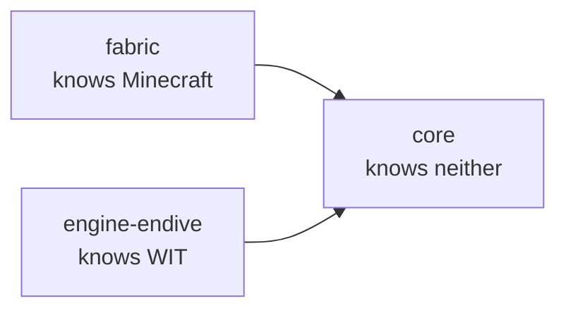
```mermaid
flowchart LR
  fabric["fabric<br/>knows Minecraft"] --> core["core<br/>knows neither"]
  endive["engine-endive<br/>knows WIT"] --> core
```

`core` is plain Java. It owns component lifecycle, sessions, event queues, dispatch, capability resolution, quotas, the outbox, network routing, the handshake, and diagnostics. It defines a small runtime interface and a handful of platform ports, and it imports nothing from Minecraft, Fabric, the WebAssembly runtime, or generated bindings. `engine-endive` implements the runtime interface on top of Endive CM and contains the generated WIT bindings. `fabric` implements the platform ports, translates Minecraft callbacks into core events, and hosts the composition root.

Components are compiled once per game launch and instantiated once per server connection. They execute only on the Minecraft client thread and only at two drain points. Each call into a component is one batched export invocation. A host import that reads state returns immediately. A host import that changes state records an effect in the outbox, which Pumpkin Patch validates and applies after the export returns. If the export traps, the outbox is discarded. No instance is ever re-entered, and a component that traps is marked `FAULTED` for the rest of the session while all other components continue.

All mod traffic travels over one multiplexed custom payload, `pumpkin:mux`. Payloads are opaque bytes. A handshake during connection configuration establishes which mods are active and assigns each a route. Servers never send executable code: components are installed by the user, and a server can only state which components and versions it requires.

The first milestone is a vertical slice. A Pumpkin server sends a message, a client component receives it and replies, and a second, deliberately failing component traps without affecting the first. This v0 host supports behavior using existing game content, messaging, and a simple HUD. It does not yet register new blocks, items, or client assets; section 38 records the separate content-mod design needed for that goal.

## 2. Goals

1. **One reusable host.** A single Fabric mod runs many components. No per-mod Java wrapper is needed.
2. **WIT as the platform ABI.** Component authors target Pumpkin-owned WIT. The Java internals of Pumpkin Patch are not part of the contract.
3. **Client, server, or both.** A mod may ship a client component, a server component, or both. The two share source, protocol definitions, and data models, but they are separate binaries.
4. **Least privilege.** A component receives only the host interfaces that it declares and the user allows.
5. **Fault isolation.** A component that traps, misbehaves at the host boundary, or exceeds an enforceable quota is stopped without corrupting other components. Runtime defects and JVM-wide resource exhaustion remain outside this guarantee (section 29).
6. **Testability without Minecraft.** Lifecycle, routing, capabilities, quotas, the handshake, version compatibility, and multi-component behavior are testable without launching the game.
7. **Replaceable edges.** Replacing the runtime, or supporting another Minecraft client platform, means rewriting one edge module and not the core.
8. **Diagnosable behavior.** A user can determine which component is slowing the game, faulting, or sending excessive traffic.
9. **Synchronous first.** Everything works on the synchronous Component Model path. The shape of the ABI allows a later move to native Component Model async.

## 3. Non-goals

The following are outside v0. Items marked *Deferred* are listed in section 38.

- **Server-delivered executable code.** Servers never send components to clients.
- **Component-to-component linking or dependencies.** There is no inter-component call, service locator, or composition at the host level. *Deferred (DD-5).*
- **Cancellable or synchronous events.** v0 events are notifications. *Deferred (DD-3).*
- **World rendering and custom screens.** v0 draws HUD primitives only. *Deferred (DD-2).*
- **Host-managed resources** such as textures and streams.
- **A dedicated Wasm execution thread.** *Deferred (DD-11).*
- **Hot reload as a user feature.** Reload exists as a developer command.
- **WASI beyond an agreed minimal subset.** No filesystem, sockets, HTTP, or clipboard access. *Open (OQ-4).*
- **A generic Wasm value model.** The runtime interface has no `invoke(String, Object[])`.
- **Other Java loaders.** NeoForge and Quilt are not v0 targets. The port boundary makes them possible.
- **Typed mod-private protocols in the platform ABI.** Pumpkin does not version any mod's private message schema.
- **New block and item types, tags, and client assets.** v0 uses existing Minecraft content. A full content-mod path needs startup registration on both Pumpkin and the Java client, stable identifiers and state mappings, and an asset package (DD-15).

---

## 4. System context

Pumpkin Patch is the client half of the Pumpkin mod ecosystem. The server half is Pumpkin itself, which runs server components on Wasmtime.

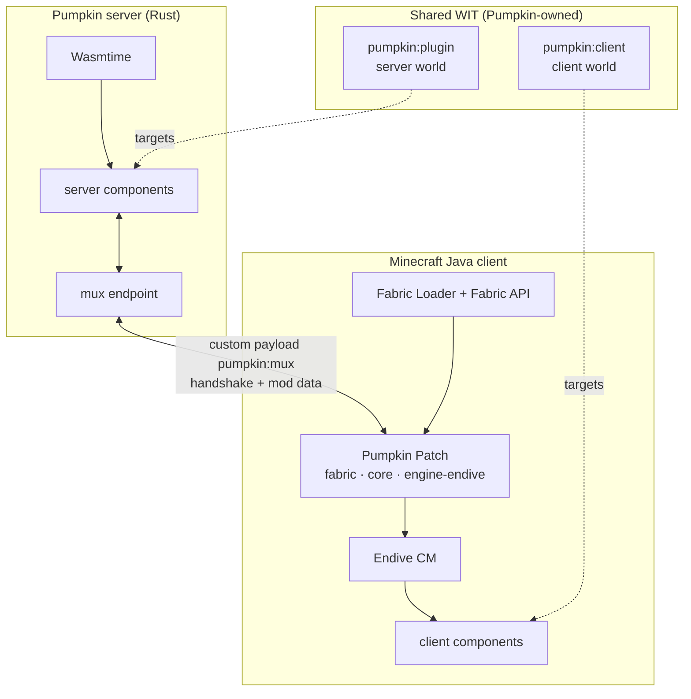
```mermaid
flowchart TB
  subgraph WIT["Shared WIT (Pumpkin-owned)"]
    direction LR
    SW["pumpkin:plugin<br/>server world"]
    CW["pumpkin:client<br/>client world"]
  end

  subgraph SERVER["Pumpkin server (Rust)"]
    direction TB
    WT["Wasmtime"] --> SC["server components"]
    SC <--> MUXS["mux endpoint"]
  end

  subgraph CLIENT["Minecraft Java client"]
    direction TB
    FL["Fabric Loader + Fabric API"] --> HOST["Pumpkin Patch<br/>fabric · core · engine-endive"]
    HOST --> ECM["Endive CM"] --> CC["client components"]
  end

  SW -. targets .-> SC
  CW -. targets .-> CC
  MUXS <-->|"custom payload pumpkin:mux<br/>handshake + mod data"| HOST
```

A mod such as `example:minimap` ships three files: `server.wasm`, which the server operator installs into Pumpkin; `client.wasm`, which the player installs into `<gameDir>/pumpkin-mods/`; and `pumpkin-mod.toml`, the manifest. This example uses existing game content. A mod that introduces a new block or item also needs content definitions and assets, which the v0 package format cannot represent.

### Upstream dependencies

Pumpkin Patch depends on the behavior of four upstream projects. The table records what it relies on.

| Project | What Pumpkin Patch relies on | Source |
|---|---|---|
| Pumpkin server | Server plugins are WebAssembly components that run on Wasmtime and target the `pumpkin:plugin` WIT package, for example `pumpkin:plugin/event@0.1.0`. The package lives in the `pumpkin-plugin-wit` repository. | [pumpkin-api-ts](https://github.com/Pumpkin-MC/pumpkin-api-ts), [pumpkin-api-kt](https://github.com/Pumpkin-MC/pumpkin-api-kt) |
| Pumpkin server | `pumpkin:plugin@0.2.0` makes the plugin ABI asynchronous. Callbacks and host functions become `async` in WIT. | [Pumpkin PR #3713](https://github.com/Pumpkin-MC/Pumpkin/pull/3713) |
| Fabric | A custom payload type is registered in `PayloadTypeRegistry` on both ends before any receiver is registered for it. Configuration-phase and play-phase networking have separate registries and separate receiver APIs. | [ServerConfigurationNetworking](https://maven.fabricmc.net/docs/fabric-api-0.144.3+26.1/net/fabricmc/fabric/api/networking/v1/ServerConfigurationNetworking.html), [Fabric networking guide](https://docs.fabricmc.net/develop/networking) |
| Component Model | A component interacts with its environment only by having its exports called and by calling its imports. A world describes the imports and exports of a component. | [Worlds](https://component-model.bytecodealliance.org/design/worlds.html) |
| Endive CM | The runtime contract in section 11. Pumpkin Patch treats each item in that contract as available. | Section 11 |

### Relationship to the server world

Client components target `pumpkin:client/client-mod`. Server components target the `pumpkin:plugin` world, which the Pumpkin server owns and which is becoming asynchronous. The client ABI is synchronous. The two sides of a mod therefore share a **wire protocol** (section 23) and their own codecs and data models, and do not share WIT types or handler code. Section 20.2 describes how the WIT packages relate.

---

## 5. Architectural principles

1. **Fabric knows Minecraft, the runtime knows WIT, core knows neither.** Module dependencies enforce this. It is not a convention.
2. **Two models, not three.** Minecraft types stay in `fabric`. Generated WIT types stay in `engine-endive`. `core` defines its own small records. No layer between them copies Minecraft into a `PlayerService` or `WorldService`.
3. **Ports are shaped by their consumer.** A port exists only where core needs something from the platform and tests substitute it. A port returns what a component needs, such as snapshots and draw targets, and not what Minecraft happens to expose.
4. **Components run only when the host decides.** Minecraft callbacks translate a change into an immutable event and enqueue it. Pumpkin Patch drains the queue at fixed points on one thread.
5. **Reads are direct and writes are staged.** A host import that reads state answers immediately. A host import that changes state writes to the outbox.
6. **The ABI is batched.** One export call per component per drain point. Lists go in and lists come out. No design requires a call per event or per entity.
7. **Values before handles.** Components receive immutable snapshots and epoch-stamped references. A resource is used only for a host-owned object with a real lifetime, and v0 has none.
8. **State does not cross connections.** A component instance lives for one session.
9. **Everything from a guest is untrusted.** The host validates every length, id, string, and count at the import boundary.
10. **Every abstraction is used today.** A seam exists because a test or a current module uses it, and not because a future platform might.

---

## 6. Module architecture

### 6.1 Modules

| Module | May depend on | Must not depend on | Responsibility |
|---|---|---|---|
| `wit` | WIT only | | Source of truth for the `pumpkin:base` and `pumpkin:client` packages, one directory per released version. |
| `core` | The JDK, a logging facade, a TOML parser | Minecraft, Fabric, the runtime, generated bindings | Lifecycle, sessions, dispatch, outbox, capabilities, quotas, network routing and handshake, manifests, diagnostics, ports, and the runtime interface. |
| `engine-endive` | `core`, the Endive CM runtime, generated bindings | Minecraft, Fabric | Implements `ComponentRuntime`. Holds one binder per supported WIT version and converts between wire types and core records. |
| `fabric` | `core`, Minecraft, Fabric API. `engine-endive` in the composition root only. | Generated bindings, runtime types | Entrypoint, event translators, port implementations, the `pumpkin:mux` transport, key bindings, and the diagnostics command. |
| `testing` | `core` | Minecraft, the runtime | Fakes, a deterministic tick harness, and a scenario DSL. |
| `fixtures` | WIT, `wasm-tools` | Java | Small guest components built from `.wat` for runtime integration tests. |

### 6.2 Internal architecture

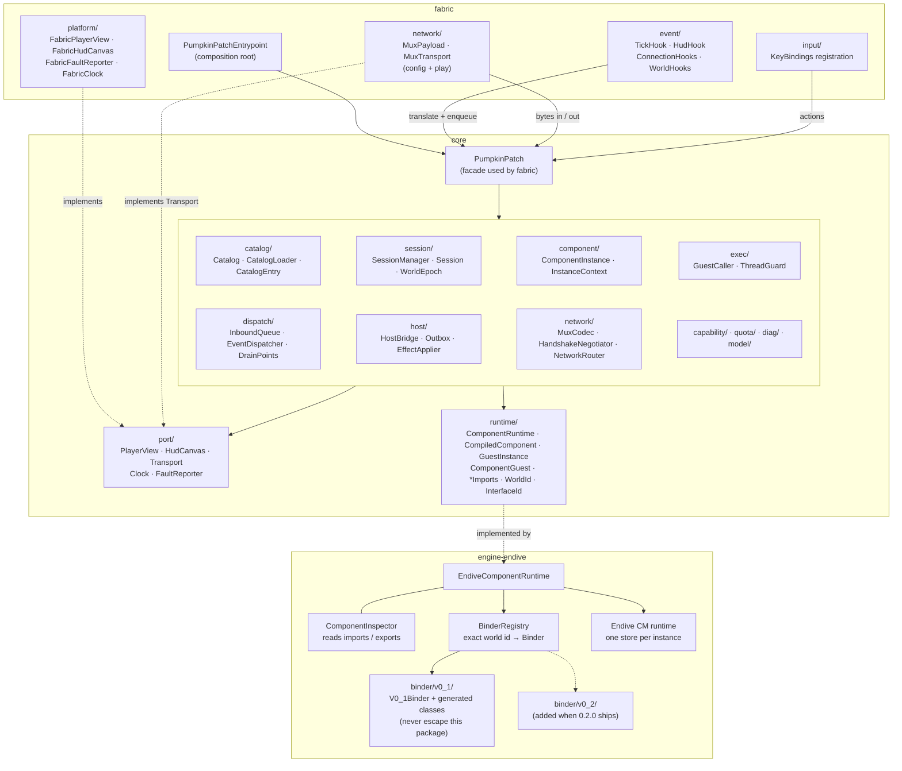
```mermaid
flowchart TB
  subgraph FABRIC["fabric"]
    EP["PumpkinPatchEntrypoint<br/>(composition root)"]
    EV["event/<br/>TickHook · HudHook<br/>ConnectionHooks · WorldHooks"]
    PL["platform/<br/>FabricPlayerView · FabricHudCanvas<br/>FabricFaultReporter · FabricClock"]
    NW["network/<br/>MuxPayload · MuxTransport<br/>(config + play)"]
    IN["input/<br/>KeyBindings registration"]
  end

  subgraph CORE["core"]
    H["PumpkinPatch<br/>(facade used by fabric)"]
    subgraph CORE_PKGS[" "]
      direction LR
      c1["catalog/<br/>Catalog · CatalogLoader · CatalogEntry"]
      c2["session/<br/>SessionManager · Session · WorldEpoch"]
      c3["component/<br/>ComponentInstance · InstanceContext"]
      c4["exec/<br/>GuestCaller · ThreadGuard"]
      c5["dispatch/<br/>InboundQueue · EventDispatcher · DrainPoints"]
      c6["host/<br/>HostBridge · Outbox · EffectApplier"]
      c7["network/<br/>MuxCodec · HandshakeNegotiator · NetworkRouter"]
      c8["capability/ · quota/ · diag/ · model/"]
      c1 ~~~ c2 ~~~ c3 ~~~ c4
      c5 ~~~ c6 ~~~ c7 ~~~ c8
    end
    PORT["port/<br/>PlayerView · HudCanvas · Transport<br/>Clock · FaultReporter"]
    RT["runtime/<br/>ComponentRuntime · CompiledComponent · GuestInstance<br/>ComponentGuest · *Imports · WorldId · InterfaceId"]
    H --> CORE_PKGS
    CORE_PKGS --> PORT
    CORE_PKGS --> RT
  end

  subgraph ENGINE["engine-endive"]
    ER["EndiveComponentRuntime"] --- CI["ComponentInspector<br/>reads imports / exports"]
    ER --> BR["BinderRegistry<br/>exact world id → Binder"]
    BR --> B1["binder/v0_1/<br/>V0_1Binder + generated classes<br/>(never escape this package)"]
    BR -.-> B2["binder/v0_2/<br/>(added when 0.2.0 ships)"]
    ER --> ECM["Endive CM runtime<br/>one store per instance"]
  end

  EP --> H
  EV -->|"translate + enqueue"| H
  NW -->|"bytes in / out"| H
  IN -->|"actions"| H
  PL -. "implements" .-> PORT
  NW -. "implements Transport" .-> PORT
  RT -. "implemented by" .-> ER
```

---

## 7. Dependency rules

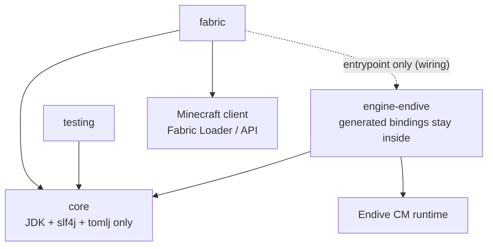
```mermaid
flowchart TB
  core["core<br/>JDK + slf4j + tomlj only"]
  fabric["fabric"] --> core
  testing["testing"] --> core
  engine["engine-endive<br/>generated bindings stay inside"] --> core
  fabric -. "entrypoint only (wiring)" .-> engine
  fabric --> mc["Minecraft client<br/>Fabric Loader / API"]
  engine --> ecm["Endive CM runtime"]
```

The permitted edges are `fabric → core`, `engine-endive → core`, `testing → core`, and `fabric/entrypoint → engine-endive`. The last edge exists only so that the entrypoint can construct `EndiveComponentRuntime`.

Four rules apply:

| Rule | Enforcement |
|---|---|
| `core` imports no `net.minecraft.*`, `net.fabricmc.*`, runtime, or generated packages. | Gradle module dependencies and an ArchUnit test in `core`. |
| Generated classes are referenced only inside `engine-endive/.../binder/vX_Y/`. | ArchUnit test in `engine-endive`. |
| `fabric` references `engine-endive` only from the `entrypoint` package. | ArchUnit test in `fabric`. |
| `core` has no static mutable state. All state hangs off `PumpkinPatch`. | Review, and tests that create several hosts in one JVM. |

The API of `core` that `fabric` uses is `PumpkinPatch` and the types in `port/`. Everything else is package-private.

---

## 8. Package and module tree

The base Java package is `dev.pumpkinmc.patch`.

```text
pumpkin-patch/
├── settings.gradle.kts
├── docs/
│   └── ARCHITECTURE.md                       # this document
├── wit/
│   ├── README.md                             # release rules, provenance of each release
│   ├── CHANGELOG.md
│   ├── base/                                 # package pumpkin:base@0.1.0
│   │   └── types.wit
│   └── client/                               # package pumpkin:client@0.1.0
│       ├── model.wit  log.wit  view.wit  net.wit  hud.wit
│       ├── guest.wit
│       ├── world.wit                         # world client-mod
│       └── deps/pumpkin-base/                # resolved copy of pumpkin:base
├── core/
│   └── src/main/java/dev/pumpkinmc/patch/core/
│       ├── PumpkinPatch.java                 # facade: tick(), renderHud(), session hooks, diagnostics
│       ├── PatchConfig.java
│       ├── manifest/
│       │   ├── Manifest.java                 # record
│       │   ├── ManifestParser.java           # TOML → Manifest
│       │   └── ManifestValidator.java        # pure; returns List<Problem>
│       ├── catalog/
│       │   ├── Catalog.java                  # immutable snapshots after load
│       │   ├── CatalogEntry.java             # manifest + status + CompiledComponent
│       │   ├── CatalogLoader.java            # discover → validate → resolve → compile
│       │   └── ComponentSource.java          # bytes + sha256 + path + declared WorldId
│       ├── component/
│       │   ├── ComponentInstance.java        # per-session state machine
│       │   ├── InstanceState.java
│       │   └── InstanceContext.java          # grants, quotas, subscriptions, stats, outbox
│       ├── session/
│       │   ├── SessionManager.java
│       │   ├── Session.java
│       │   ├── SessionInfo.java
│       │   └── WorldEpoch.java
│       ├── exec/
│       │   ├── GuestCaller.java              # the only caller of guest exports
│       │   ├── ExecutionGuard.java           # re-entry prevention
│       │   └── ThreadGuard.java              # asserts client thread
│       ├── dispatch/
│       │   ├── InboundQueue.java             # MPSC; the only cross-thread structure
│       │   ├── EventDispatcher.java          # per-instance batches, filtering, ordering
│       │   └── DrainPoint.java               # TICK, HUD
│       ├── host/
│       │   ├── HostBridge.java               # implements runtime/*Imports per instance
│       │   ├── Outbox.java
│       │   ├── Effect.java                   # sealed: NetSend, …
│       │   ├── EffectApplier.java
│       │   └── CallPhase.java                # INIT, EVENTS, RENDER, SHUTDOWN
│       ├── network/
│       │   ├── MuxCodec.java                 # frame encode/decode
│       │   ├── MuxFrame.java                 # sealed: Hello, Reply, Accept, Data, Close
│       │   ├── HandshakeNegotiator.java      # pure function over catalog + hello
│       │   ├── NegotiationResult.java
│       │   └── NetworkRouter.java            # route id ↔ instance, channel index ↔ name
│       ├── capability/
│       │   ├── Capability.java               # enum: LOG, VIEW, NET, HUD, INPUT
│       │   ├── CapabilityResolver.java       # imports ∩ manifest ∩ policy
│       │   └── Policy.java                   # user config
│       ├── quota/
│       │   ├── Quotas.java                   # limits record
│       │   └── QuotaMeter.java               # per-instance counters, per-tick reset
│       ├── diag/
│       │   ├── InstanceStats.java
│       │   ├── FaultRecord.java
│       │   └── DiagnosticsSnapshot.java
│       ├── model/
│       │   ├── Vec3.java  WorldRef.java  PlayerSnapshot.java  EntitySnapshot.java
│       │   ├── Event.java                    # sealed interface + records
│       │   ├── DrawCommand.java              # sealed interface + records
│       │   ├── FrameInfo.java  FrameOutput.java  InitInfo.java  InitResult.java
│       │   └── HostError.java                # exception carrying a HostErrorCode
│       ├── port/
│       │   ├── PlayerView.java
│       │   ├── HudCanvas.java
│       │   ├── Transport.java
│       │   ├── Clock.java
│       │   └── FaultReporter.java
│       └── runtime/
│           ├── ComponentRuntime.java
│           ├── CompiledComponent.java
│           ├── GuestInstance.java
│           ├── ComponentGuest.java           # hand-written mirror of the world's exports
│           ├── HostImports.java              # aggregate of the *Imports below
│           ├── LogImports.java  NetImports.java  ViewImports.java  HudImports.java
│           ├── WorldId.java  InterfaceId.java  # exact WIT ids as strings
│           ├── GuestTrap.java                # runtime failure surfaced to core
│           └── RuntimeLimits.java
├── engine-endive/
│   └── src/main/java/dev/pumpkinmc/patch/endive/
│       ├── EndiveComponentRuntime.java       # implements ComponentRuntime
│       ├── EndiveCompiledComponent.java
│       ├── EndiveGuestInstance.java
│       ├── ComponentInspector.java           # imports and exports of a parsed component
│       ├── BinderRegistry.java               # WorldId → Binder
│       ├── Binder.java                       # internal SPI, not part of core
│       ├── TrapTranslator.java               # runtime exceptions → GuestTrap
│       └── binder/
│           └── v0_1/
│               ├── package-info.java         # @Bindgen for pumpkin:client@0.1.0
│               ├── V0_1Binder.java
│               ├── V0_1Imports.java          # generated Imports impl → core *Imports
│               ├── V0_1Guest.java            # generated exports → ComponentGuest
│               └── V0_1Convert.java          # wire ↔ core records (the only mapping code)
│       (generated sources are emitted under binder/v0_1/** at compile time)
├── fabric/
│   └── src/main/java/dev/pumpkinmc/patch/fabric/
│       ├── entrypoint/
│       │   └── PumpkinPatchEntrypoint.java   # ClientModInitializer; composition root
│       ├── event/
│       │   ├── TickHook.java
│       │   ├── ConnectionHooks.java          # configuration start, join, disconnect
│       │   ├── WorldHooks.java               # world and dimension change, respawn
│       │   └── EventTranslators.java         # pure Minecraft → core.model mappings
│       ├── network/
│       │   ├── MuxPayload.java               # CustomPacketPayload + codec (opaque bytes)
│       │   └── FabricMuxTransport.java       # implements Transport (config + play)
│       ├── render/
│       │   ├── HudHook.java
│       │   └── FabricHudCanvas.java          # implements HudCanvas
│       ├── input/
│       │   └── KeyBindingRegistrar.java      # registers manifest-declared actions at init
│       ├── platform/
│       │   ├── FabricPlayerView.java         # implements PlayerView
│       │   ├── FabricClock.java
│       │   └── FabricFaultReporter.java      # toast + log
│       └── command/
│           └── PumpkinPatchCommand.java      # /pumpkinpatch list|stats|faults|reload
│   └── src/main/resources/fabric.mod.json    # mod id: pumpkin-patch
├── testing/
│   └── src/main/java/dev/pumpkinmc/patch/testing/
│       ├── FakeGuest.java  ScriptedGuest.java  FakeRuntime.java
│       ├── FakePlayerView.java  RecordingHudCanvas.java  LoopbackTransport.java
│       ├── ManualClock.java
│       ├── PatchHarness.java                 # builds a host, drives ticks deterministically
│       └── FakePumpkinServer.java            # speaks the mux protocol for tests
└── fixtures/
    ├── build.gradle.kts                      # runs wasm-tools component embed / new
    └── src/
        ├── v0_1/hello.wat  echo.wat  trap-init.wat  trap-events.wat
        │        spin.wat  oversize-send.wat  denied-net.wat  hud-text.wat
        └── README.md
```

---

## 9. Composition root

`PumpkinPatchEntrypoint` is a Fabric `ClientModInitializer`. It is the only place where concrete classes from all three modules meet.

```java
public final class PumpkinPatchEntrypoint implements ClientModInitializer {
    @Override public void onInitializeClient() {
        PatchConfig config = PatchConfig.load(FabricLoader.getInstance().getConfigDir());

        ComponentRuntime runtime = new EndiveComponentRuntime(config.runtimeLimits());

        Ports ports = new Ports(
            new FabricPlayerView(),          // reads MinecraftClient lazily, client thread only
            new FabricHudCanvas(),
            new FabricMuxTransport(),
            new FabricClock(),
            new FabricFaultReporter());

        PumpkinPatch patch = PumpkinPatch.create(config, runtime, ports);

        // Launch-scope work. Manifests are read synchronously because key bindings
        // must be registered during init. Compilation runs on one background thread.
        patch.catalog().discover(config.modsDirectory());
        KeyBindingRegistrar.register(patch.catalog().declaredActions(), patch);
        patch.catalog().compileInBackground();

        MuxPayload.register();                      // PayloadTypeRegistry, before receivers
        FabricMuxTransport.registerReceivers(patch); // enqueue only
        TickHook.register(patch);                    // start of client tick → patch.tick()
        HudHook.register(patch);                     // HUD layer → patch.renderHud(...)
        ConnectionHooks.register(patch);             // session start and end
        WorldHooks.register(patch);                  // world and dimension changes → events
        PumpkinPatchCommand.register(patch);
    }
}
```

The entrypoint wires objects together and does not branch on component state. Discovery, which reads manifests, is synchronous because Fabric expects key bindings to be registered during initialization. Compilation runs on a single background thread so that a slow compile does not extend the loading screen.

If a session starts before compilation finishes, `SessionManager` waits for the catalog for at most `catalogWaitMillis`. Entries that are still not compiled at that point are left out of the session and reported.

---

## 10. Core abstractions

### 10.1 Runtime interface

The runtime interface is the smallest boundary that keeps the runtime replaceable. It has no generic invoke operation and no Wasm value model. It is a compile step, an instantiate step, and a hand-written mirror of the world's exports.

```java
/** Compiles component bytes. One per host. Called from the catalog compile thread. */
public interface ComponentRuntime {
    CompiledComponent compile(ComponentSource source, RuntimeLimits limits) throws CompileException;
}

/** A validated, compiled component. Immutable. Safe to instantiate many times. */
public interface CompiledComponent extends AutoCloseable {
    WorldId world();                          // manifest-declared world, verified by import/export shape
    Set<InterfaceId> importedInterfaces();    // exact ids, e.g. "pumpkin:client/net@0.1.0"
    GuestInstance instantiate(HostImports imports) throws InstantiationException;
}

/** One live instance. Confined to one thread. Closing releases its store. */
public interface GuestInstance extends ComponentGuest, AutoCloseable {}

/** Hand-written mirror of the client-mod world's exports, in core types. */
public interface ComponentGuest {
    InitResult init(InitInfo info) throws GuestTrap, GuestInitError;
    void handleEvents(List<Event> batch) throws GuestTrap;
    FrameOutput render(FrameInfo frame) throws GuestTrap;
    void shutdown() throws GuestTrap;
}
```

`HostImports` groups one core interface per WIT import interface. Its methods take and return core records and signal expected failures by throwing `HostError`.

```java
public interface HostImports { LogImports log(); NetImports net(); ViewImports view(); HudImports hud(); }

public interface NetImports {
    void send(String channel, byte[] payload) throws HostError;   // staged in the outbox
    int maxPayloadBytes();
}
public interface ViewImports {
    PlayerSnapshot localPlayer() throws HostError;
    WorldRef currentWorld() throws HostError;
    List<EntitySnapshot> nearbyEntities(double radius, int max) throws HostError;
}
```

`core.host.HostBridge` implements `HostImports`, once per instance. Phase checks, capability denials, quotas, validation, and outbox staging all live there, so every runtime and every WIT version receives the same enforcement.

### 10.2 Platform ports

| Port | Implemented in `fabric` by | Used by | Shape |
|---|---|---|---|
| `PlayerView` | `FabricPlayerView` | `HostBridge`, for the `view` imports | `Optional<PlayerSnapshot> localPlayer()`, `Optional<WorldRef> world(int epoch)`, `List<EntitySnapshot> entitiesNear(Vec3, double, int)` |
| `HudCanvas` | `FabricHudCanvas` | The render drain | `void draw(List<DrawCommand>)`, `int measureText(String)`, `FrameInfo frameInfo()` |
| `Transport` | `FabricMuxTransport` | `NetworkRouter`, `EffectApplier` | `void sendFrame(byte[])`, `int maxOutboundFrameBytes()`. Inbound frames arrive through `patch.onFrameReceived(byte[])`. |
| `Clock` | `FabricClock`, `ManualClock` in tests | Execution timing, quotas, events | `long nanoTime()`, `long gameTick()` |
| `FaultReporter` | `FabricFaultReporter` | `ComponentInstance`, on fault | `void report(FaultRecord)` |

There are no ports named `PlayerService`, `WorldService`, or `EntityService`.

### 10.3 Core model

The core model is a small set of immutable records. Binders translate them to and from generated types, and the Fabric translators produce them from Minecraft state.

```java
public record Vec3(double x, double y, double z) {}
public record WorldRef(String dimension, int epoch) {}
public record PlayerSnapshot(UUID id, String name, Vec3 pos, float yaw, float pitch,
                             float health, WorldRef world) {}
public record EntitySnapshot(UUID id, String type, Vec3 pos) {}

public sealed interface Event {
    record SessionStarted(SessionInfo info) implements Event {}
    record WorldChanged(WorldRef world) implements Event {}
    record Tick(long gameTick) implements Event {}
    record NetMessage(String channel, byte[] payload) implements Event {}
    record Action(String actionId, boolean pressed) implements Event {}
    record SessionEnding() implements Event {}
}

public sealed interface DrawCommand {
    record Text(int x, int y, String text, int argb, boolean shadow) implements DrawCommand {}
    record FillRect(int x, int y, int w, int h, int argb) implements DrawCommand {}
}
```

---

## 11. Runtime adapter

`engine-endive` implements `ComponentRuntime` with Endive CM, a Component Model runtime for the JVM. It is the only module that imports the runtime or the generated WIT bindings.

### 11.1 Runtime contract

Pumpkin Patch places the following requirements on its runtime. These are acceptance conditions, not claims that the current Endive CM release already meets them. Each has a fixture in the conformance suite (section 32.3). In particular, multi-file WIT dependency loading and a safe hard execution budget remain unverified for this design.

| # | Requirement | Used for |
|---|---|---|
| R1 | Compilation is separate from instantiation. A compiled component is immutable and can be instantiated any number of times. | Compile once per launch and instantiate once per session (section 14). |
| R2 | A compiled component can be handed from the compile thread to the client thread. An instance is confined to one thread and is never shared. | The threading model (section 16). |
| R3 | Each instance owns a store. Memory, tables, and globals are not shared between stores, and closing a store releases all of them. | Isolation between components and cleanup at session end. |
| R4 | The execution of a single call has a reliable hard bound that stops a looping guest without leaving the Minecraft client thread interrupted or unusable. The bound ends the call in a distinguishable trap. | Enforcing the call budget (section 29). Timing a call after it returns is not sufficient. |
| R5 | Linear memory and table growth can be limited per instance. | Memory quota (section 30). |
| R6 | A WIT package can span several files, and `use` can refer to another package. | The `pumpkin:base` and `pumpkin:client` split (section 20). |
| R7 | Imports are linked by exact WIT id. Versioned ids that are compatible under the Component Model's canonical interface-name rules also link, and the interface types are checked after the names match. | Patch-compatible releases (section 21). |
| R8 | Binding generation supports records, variants, enums, flags, options, results, lists, and exported interfaces. `list<u8>` maps to `byte[]`. | The shape of the WIT and the cost of network payloads. |
| R9 | Traps and host errors are distinct and catchable in Java. A trap reports its kind: unreachable code, out-of-bounds access, exhausted budget, or exceeded memory limit. | The fault model (section 29). |
| R10 | The synchronous Canonical ABI is complete. Asynchronous functions, streams, and futures are not required. | Synchronous-first execution. |
| R11 | The runtime is pure Java and uses no native libraries. It loads under the Fabric class loader when nested in the mod jar. | Packaging (section 12.3). |

A runtime release that fails any fixture is not adopted. Endive's existing thread-interruption tests do not by themselves prove R4 on the Minecraft client thread or for every execution engine. If R4 cannot be met safely, execution must move off that thread or the runtime choice must change before untrusted components are supported. Endive CM's current bindgen design documents single-file WIT input, so R6 needs implementation or a revised WIT package layout. Open question OQ-1 records which release Pumpkin Patch pins.

### 11.2 Adapter structure

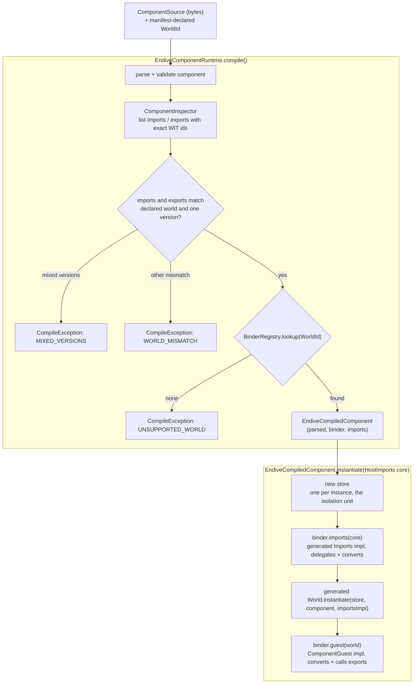
```mermaid
flowchart TB
  SRC["ComponentSource (bytes)<br/>+ manifest-declared WorldId"]
  subgraph COMPILE["EndiveComponentRuntime.compile()"]
    direction TB
    p1["parse + validate component"] --> p2["ComponentInspector<br/>list imports / exports with exact WIT ids"]
    p2 --> p3{"imports and exports match<br/>declared world and one version?"}
    p3 -->|mixed versions| x1["CompileException: MIXED_VERSIONS"]
    p3 -->|other mismatch| x3["CompileException: WORLD_MISMATCH"]
    p3 -->|yes| p4{"BinderRegistry.lookup(WorldId)"}
    p4 -->|none| x2["CompileException: UNSUPPORTED_WORLD"]
    p4 -->|found| p5["EndiveCompiledComponent<br/>(parsed, binder, imports)"]
  end
  subgraph INST["EndiveCompiledComponent.instantiate(HostImports core)"]
    direction TB
    i1["new store<br/>one per instance, the isolation unit"] --> i2["binder.imports(core)<br/>generated Imports impl, delegates + converts"]
    i2 --> i3["generated World.instantiate(store, component, importsImpl)"]
    i3 --> i4["binder.guest(world)<br/>ComponentGuest impl, converts + calls exports"]
  end
  SRC --> p1
  p5 --> i1
```

### 11.3 Responsibilities of the adapter

The adapter has four responsibilities and no others.

**Translation.** Generated types and core records are converted only in `binder/vX_Y/*Convert.java`. Imports convert from wire types to core records on the way in, and exports convert from core records to wire types on the way out.

**Error mapping.** A core `HostError(code, detail)` maps to the generated `host-error` variant and reaches the guest as the error case of a `result`. A runtime trap, and any unexpected runtime exception, maps to `GuestTrap(kind, message)`. `TrapTranslator` is the only class that knows the runtime's exception types.

**Limits.** `RuntimeLimits` carries the memory limit and the call budget to the runtime. The adapter applies every limit it is given. If the runtime cannot enforce one, the adapter fails at startup and does not ignore it. The call budget is a safety ceiling, not a frame-time target; section 33 also evaluates aggregate guest time per tick.

**No policy.** The adapter does not check capabilities, quotas, or call phases. `HostBridge` does.

### 11.4 Replacing the runtime

A second runtime implements `ComponentRuntime`, `CompiledComponent`, and `GuestInstance`, and provides one binder per supported WIT version that produces a `ComponentGuest` and consumes `HostImports`. Nothing in `core` or `fabric` changes. The contract in section 11.1 is what a replacement has to satisfy.

---

## 12. Fabric adapter

### 12.1 Responsibilities

The `fabric` module does seven things:

1. It hosts the composition root (section 9).
2. It translates Minecraft callbacks into core records. Each translator is a small pure function in `EventTranslators` that contains no logic. No Wasm runs inside a Fabric callback, with the exception of the two drain hooks.
3. It installs the drain hooks: the start of the client tick calls `patch.tick()`, and the HUD render phase calls `patch.renderHud(canvas)`.
4. It implements the ports: `FabricPlayerView`, `FabricHudCanvas`, `FabricMuxTransport`, `FabricClock`, and `FabricFaultReporter`.
5. It registers one payload type, `pumpkin:mux`, whose codec reads and writes raw bytes. Receivers copy the bytes and call `patch.onFrameReceived(byte[])`.
6. It registers key bindings for the actions that manifests declare (section 28).
7. It provides the `/pumpkinpatch` command, which formats a `DiagnosticsSnapshot` from core.

### 12.2 Version isolation

Minecraft and Fabric APIs change between versions. Class names differ across mapping regimes, for example `CustomPayload` and `CustomPacketPayload`, and HUD, key binding, and connection events have changed shape over time. For that reason every call into these APIs stays in `fabric`. `core` and `engine-endive` are independent of the Minecraft version and are built once.

Supporting several Minecraft versions means building several `fabric` modules against the same `core` and `engine-endive` jars. Pumpkin Patch adds no mixins in v0, because every hook it needs comes from a Fabric API event. A mixin is added only when no event exists, and it lives in `fabric` with a comment naming the missing API.

Section 39 lists the Fabric APIs that have to be selected for the target Minecraft version.

### 12.3 Packaging

The released jar nests `core`, `engine-endive`, and the runtime with Fabric Loom's jar-in-jar mechanism. Build-time tools, such as the bindgen processor and `wasm-tools`, are not shipped.

---

## 13. Component lifecycle

Two state machines match the two lifetimes in the design. A **catalog entry** lives for the game launch. A **component instance** lives for one session.

### 13.1 Catalog entry states

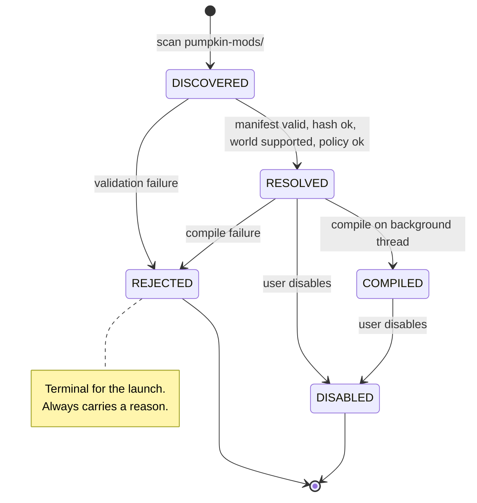
```mermaid
stateDiagram-v2
  [*] --> DISCOVERED: scan pumpkin-mods/
  DISCOVERED --> RESOLVED: manifest valid, hash ok, world supported, policy ok
  DISCOVERED --> REJECTED: validation failure
  RESOLVED --> COMPILED: compile on background thread
  RESOLVED --> REJECTED: compile failure
  RESOLVED --> DISABLED: user disables
  COMPILED --> DISABLED: user disables
  REJECTED --> [*]
  DISABLED --> [*]
  note right of REJECTED
    Terminal for the launch.
    Always carries a reason.
  end note
```

| Transition | Performed by |
|---|---|
| `DISCOVERED` → `RESOLVED` or `REJECTED` | `CatalogLoader` |
| `RESOLVED` → `COMPILED` or `REJECTED` | `CatalogLoader`, on the compile thread |
| any → `DISABLED` | `Catalog.disable(id)`, from policy or a command |

A catalog entry does not change once it is `COMPILED`, `REJECTED`, or `DISABLED`. Pumpkin Patch publishes status by atomically swapping the `Catalog` snapshot. This is the only launch-scope handoff between threads.

### 13.2 Instance states

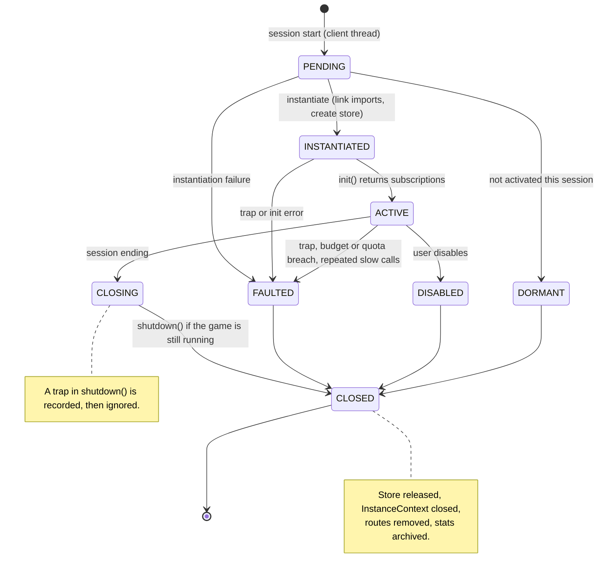
```mermaid
stateDiagram-v2
  [*] --> PENDING: session start (client thread)
  PENDING --> DORMANT: not activated this session
  PENDING --> INSTANTIATED: instantiate (link imports, create store)
  PENDING --> FAULTED: instantiation failure
  INSTANTIATED --> ACTIVE: init() returns subscriptions
  INSTANTIATED --> FAULTED: trap or init error
  ACTIVE --> FAULTED: trap, budget or quota breach, repeated slow calls
  ACTIVE --> DISABLED: user disables
  ACTIVE --> CLOSING: session ending
  CLOSING --> CLOSED: shutdown() if the game is still running
  FAULTED --> CLOSED
  DISABLED --> CLOSED
  DORMANT --> CLOSED
  CLOSED --> [*]
  note right of CLOSING
    A trap in shutdown() is recorded, then ignored.
  end note
  note right of CLOSED
    Store released, InstanceContext closed,
    routes removed, stats archived.
  end note
```

The states have the following meanings.

| State | Meaning |
|---|---|
| `PENDING` | The instance object exists and has not been instantiated. |
| `DORMANT` | The mod's activation rule is not met in this session (section 14.3). No store exists. |
| `INSTANTIATED` | The store exists and imports are linked. `init` has not returned. |
| `ACTIVE` | `init` returned. The instance receives events and render calls. |
| `FAULTED` | The instance failed. It receives nothing and is closed. |
| `DISABLED` | A user or policy stopped the instance. |
| `CLOSING` | The session is ending, and `shutdown` runs if it can. |
| `CLOSED` | All resources are released. |

Transitions happen only through methods on `ComponentInstance`, and only on the client thread. `Session` drives the normal path from `PENDING` to `CLOSED`. `GuestCaller` drives transitions to `FAULTED` for traps, exhausted budgets, and repeated slow calls. `QuotaMeter` requests a fault for hard quota breaches through `ComponentInstance.fault(...)`. The diagnostics command drives `DISABLED`.

`FAULTED` and `DISABLED` are terminal for the session. Nothing restarts automatically, and the next session creates a fresh instance from the same compiled component.

A half-initialized instance is never retained. If `init` traps or returns an error, the store is released immediately and the instance never receives an event.

`shutdown()` is best-effort. Pumpkin Patch calls it only when an instance leaves `ACTIVE` normally and the client is not exiting, and it runs under the same guard and budget as any other call. When the client is stopping, Pumpkin Patch closes all instances without calling into them, so no guest code runs during JVM shutdown.

An `AVAILABLE` handshake response precedes instantiation. If a required component faults during `init` or later, Pumpkin Patch sends `CLOSE` for its route. The server treats that as a required-mod failure according to its connection policy; the handshake itself guarantees a validated, compiled artifact rather than an infallible running instance.

There are no dependencies between components in v0 (section 25.4). Instances are ordered by mod id. The order is stable and documented, and components must not rely on it for correctness.

### 13.3 Developer reload

`/pumpkinpatch reload <id>` exists only when `developerMode` is enabled. It re-reads the manifest and component bytes, recompiles, closes the current instance with `shutdown()`, and instantiates and initializes a new one in the same session. No state moves between the two instances. Network routes remain assigned, because they belong to the mod id within the session. Reload is a development aid and is not offered as a feature to end users.

---

## 14. Session model

### 14.1 Definition

A **session** is the time from the start of one server connection's configuration phase, or from join if there is no configuration phase, until disconnect. Singleplayer worlds and LAN connections are sessions.

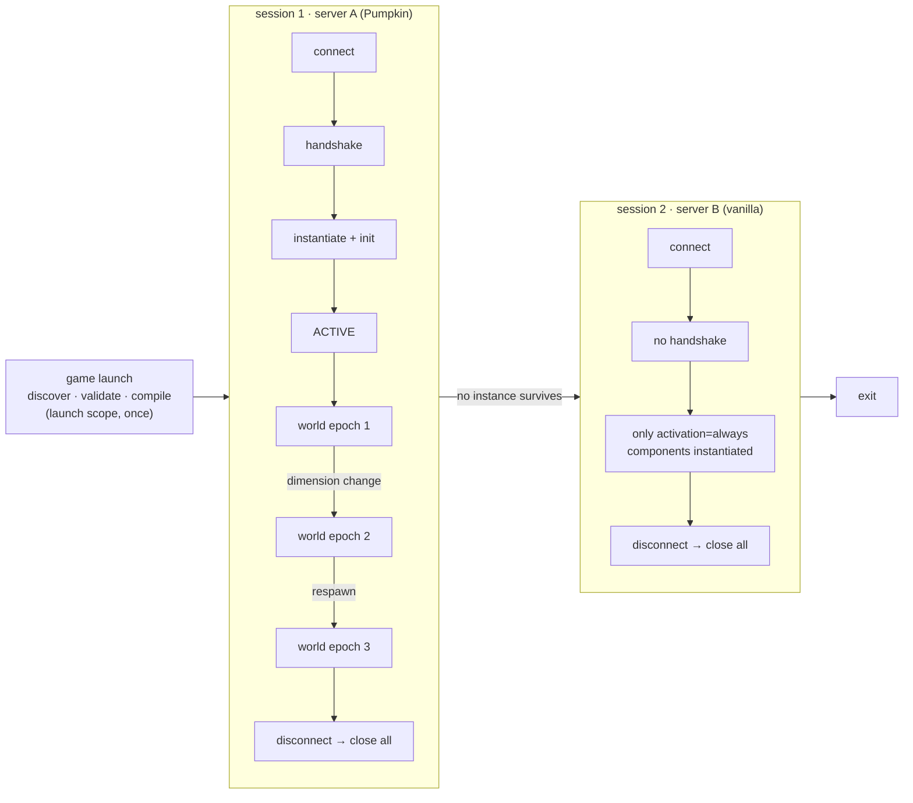
```mermaid
flowchart LR
  L["game launch<br/>discover · validate · compile<br/>(launch scope, once)"]
  subgraph S1["session 1 · server A (Pumpkin)"]
    direction TB
    a1["connect"] --> a2["handshake"] --> a3["instantiate + init"] --> a4["ACTIVE"]
    a4 --> e1["world epoch 1"] -->|"dimension change"| e2["world epoch 2"] -->|"respawn"| e3["world epoch 3"]
    e3 --> a5["disconnect → close all"]
  end
  subgraph S2["session 2 · server B (vanilla)"]
    direction TB
    b1["connect"] --> b2["no handshake"] --> b3["only activation=always<br/>components instantiated"] --> b4["disconnect → close all"]
  end
  L --> S1
  S1 -->|"no instance survives"| S2
  S2 --> X["exit"]
```

### 14.2 Session record

```java
public final class Session {
    final long id;                       // increasing within a launch, never reused
    final ConnectionKind kind;           // PUMPKIN (handshake done), NON_PUMPKIN, SINGLEPLAYER
    final NegotiationResult negotiation; // empty for NON_PUMPKIN
    final WorldEpoch worlds;             // current epoch counter
    final List<ComponentInstance> instances;  // stable order
    final EventDispatcher dispatcher;
    final NetworkRouter router;          // a no-op router for NON_PUMPKIN
}
```

### 14.3 Activation

The manifest field `activation` decides whether a component runs in a given kind of session.

| `activation` | Pumpkin server, component negotiated | Pumpkin server, component not negotiated | Other server or singleplayer |
|---|---|---|---|
| `always` | `ACTIVE`, `net` available | `ACTIVE`, `net` returns `unavailable` | `ACTIVE`, `net` returns `unavailable` |
| `pumpkin-server` | `ACTIVE` | `DORMANT` | `DORMANT` |

### 14.4 World epochs

The epoch starts at 1 in each session and increases by one whenever the client world changes: a dimension change, a respawn into a new world object, or reconfiguration. `WorldHooks` enqueue a `WorldChanged` event, and at the next tick drain core increments the epoch before it delivers `world-changed(world-ref)`.

A `world-ref` carries the epoch it was created in. In v0 it is snapshot metadata: a guest can compare it with the latest `world-changed` event or `view.current-world()` and discard old state. No v0 host import accepts a `world-ref`, so the host cannot yet return `host-error.stale` for one. If a later API accepts world references, it must check the epoch before using them.

The instance itself is per-session, so calls do not carry a session id. `init-info` includes `session-id` for logging and correlation only.

### 14.5 Session transitions

| Fabric signal | Call into core | Effect |
|---|---|---|
| Configuration phase begins | `patch.onConfigurationStart()` | Creates the session and waits for `HELLO`, or for its absence. |
| Play join | `patch.onJoin()` | Marks the session `NON_PUMPKIN` if no handshake occurred, and instantiates eligible components. |
| World or dimension change | `patch.enqueueWorldChanged(ref)` | Increments the epoch at the next drain. |
| Disconnect | `patch.onDisconnect()` | Moves every instance to `CLOSING`, then `CLOSED`, and discards queues. |
| Client stopping | `patch.onClientStopping()` | Closes all instances without guest calls. |

---

## 15. Event architecture

### 15.1 Event flow

A Fabric callback never calls a component. It translates a change into an immutable core record and places it on a queue. Pumpkin Patch empties the queue at a drain point on the client thread.

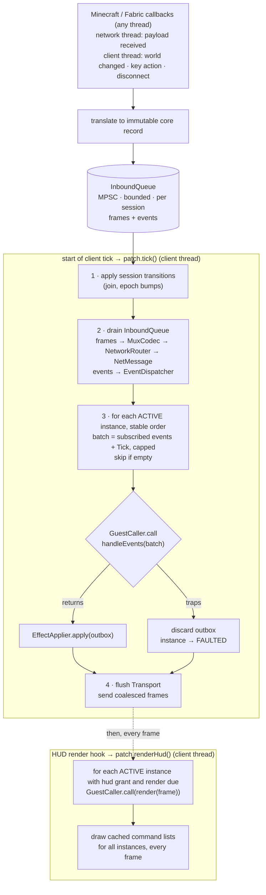
```mermaid
flowchart TB
  CB["Minecraft / Fabric callbacks (any thread)<br/>network thread: payload received<br/>client thread: world changed · key action · disconnect"]
  CB --> TR["translate to immutable core record"]
  TR --> Q[("InboundQueue<br/>MPSC · bounded · per session<br/>frames + events")]

  subgraph TICK["start of client tick → patch.tick() (client thread)"]
    direction TB
    t1["1 · apply session transitions<br/>(join, epoch bumps)"]
    t2["2 · drain InboundQueue<br/>frames → MuxCodec → NetworkRouter → NetMessage<br/>events → EventDispatcher"]
    t3["3 · for each ACTIVE instance, stable order<br/>batch = subscribed events + Tick, capped<br/>skip if empty"]
    t4{"GuestCaller.call<br/>handleEvents(batch)"}
    t5["EffectApplier.apply(outbox)"]
    t6["discard outbox<br/>instance → FAULTED"]
    t7["4 · flush Transport<br/>send coalesced frames"]
    t1 --> t2 --> t3 --> t4
    t4 -->|returns| t5 --> t7
    t4 -->|traps| t6 --> t7
  end

  subgraph HUD["HUD render hook → patch.renderHud() (client thread)"]
    direction TB
    h1["for each ACTIVE instance with hud grant and render due<br/>GuestCaller.call(render(frame))"]
    h2["draw cached command lists<br/>for all instances, every frame"]
    h1 --> h2
  end

  Q --> t1
  t7 -. "then, every frame" .-> h1
```

### 15.2 Event kinds

| Event | Source | Delivered at | Requires |
|---|---|---|---|
| `session-started` | Session creation | First tick after `ACTIVE` | Always delivered |
| `world-changed(world-ref)` | `WorldHooks` | Tick | Subscription `world` |
| `tick(tick-info)` | Tick drain | Tick | Subscription `tick` |
| `net-message(channel, bytes)` | Mux router | Tick | Capability `net` |
| `action(action-id, pressed)` | Key bindings | Tick | Subscription `input` |
| `session-ending` | Disconnect | Final drain before `CLOSING`, if the game is still running | Always delivered |

### 15.3 Subscriptions

`init` returns an `init-result` whose `subscriptions` field is a WIT `flags` value. The subscriptions are fixed for the life of the instance. There is no `subscribe` import in v0. This keeps dispatch a simple filter, avoids subscription resources, and means a guest never calls into dispatcher state.

### 15.4 Ordering

Pumpkin Patch guarantees the following order:

1. Events reach an instance in the order they were enqueued. An epoch increment is applied before any event that follows it.
2. `tick` is the last element of a batch, so a component can treat it as the end of a tick's input.
3. Instances are called in a stable order, by mod id.
4. The effects of one instance's call are applied before the next instance is called. A message that instance A sends is therefore transmitted before a message that instance B sends in the same tick.
5. An event enqueued during a drain, for example by Minecraft reacting to an applied effect, is delivered at the next tick. It is never delivered in the same drain.

### 15.5 Cancellable events

v0 has none. A later *interceptor* category would be limited to an explicit allow-list of hooks, such as outgoing chat. It would use a separate export with a hard per-call budget, allow the default action on a trap or timeout, and require its own `intercept` capability. Events do not gain a general "cancellable" flag (DD-3).

---

## 16. Threading model

### 16.1 Threads

| Thread | Work performed | Calls components? |
|---|---|---|
| Minecraft client (main) thread | Tick drain, HUD drain, instance lifecycle, all host imports, effect application | **Yes. It is the only thread that does.** |
| Netty network threads | Fabric payload receive, then `InboundQueue.offer(frame)` | No |
| Catalog compile thread | Parse, validate, and compile components | No. It compiles and never instantiates. |
| Any other thread | May call `InboundQueue.offer` and nothing else in core | No |

### 16.2 Contract

1. Every `ComponentGuest` call happens on the client thread. `ThreadGuard.check()` asserts this on entry to `GuestCaller` and in every `HostBridge` method. A violation throws `IllegalStateException`, which indicates a bug in Pumpkin Patch and not a component fault.
2. `InboundQueue` is the only concurrent data structure in a session. Everything else is confined to the client thread and uses no locks.
3. A host import never blocks on another thread. It does not wait on a future and does not submit work to the client thread and join it. A blocking call on the client thread that waits for the client thread cannot complete.
4. Fabric payload handlers may run on a network thread or on the client thread, depending on the API and the Minecraft version. The adapter treats both the same way: it copies the bytes and enqueues them.

### 16.3 Moving execution off the client thread

The design allows a dedicated execution thread later without changing WIT. Reads (`view.*`) would switch from live port calls to an immutable `WorldSnapshot` that the client thread publishes once per tick. `PlayerView` already returns snapshots. Writes already pass through the outbox, which the client thread applies. Render already returns command lists, which the client thread draws. This remains a design option, not a guarantee that the current ports make the move free. If the runtime cannot enforce R4 safely on the client thread, this change or another bounded execution strategy is required before shipping untrusted components.

---

## 17. Reentrancy model

Pumpkin Patch never re-enters an instance. Three mechanisms provide this, and any one of them is sufficient for the sequences it covers.

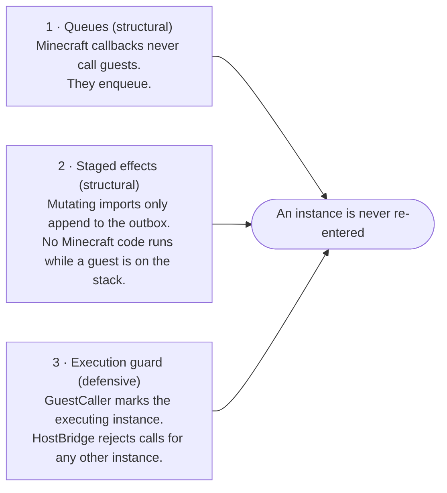
```mermaid
flowchart LR
  Q["1 · Queues (structural)<br/>Minecraft callbacks never call guests.<br/>They enqueue."]
  S["2 · Staged effects (structural)<br/>Mutating imports only append to the outbox.<br/>No Minecraft code runs while a guest is on the stack."]
  G["3 · Execution guard (defensive)<br/>GuestCaller marks the executing instance.<br/>HostBridge rejects calls for any other instance."]
  Q --> R(["An instance is never re-entered"])
  S --> R
  G --> R
```

**Queues.** The sequence *guest export, host import, Fabric callback, same guest export* cannot occur, because Fabric callbacks do not call guests.

**Staged effects.** A host import cannot cause Minecraft to fire a callback while a guest is executing, because effects are applied only after the export returns. Read-only imports only read client state.

**Execution guard.** `ExecutionGuard` holds the currently executing instance for the host. `GuestCaller` rejects a nested export call, and `HostBridge` rejects an import call from an instance that is not the executing one. Either case is a bug in Pumpkin Patch. It is logged with a stack trace, and the instance is faulted with reason `HOST_REENTRY` so that the game continues.

Components cannot call other components, because there is no inter-component linking.

---

## 18. Host imports and the outbox

### 18.1 Import kinds

| Import | Kind | Behavior |
|---|---|---|
| `log.log(level, message)` | Direct | Written to the logger immediately, with the component prefix. A per-tick line and byte quota applies, and excess lines are dropped and counted. |
| `view.local-player()`, `view.current-world()`, `view.nearby-entities(radius, max)` | Direct read | Allowed in the `EVENTS` and `RENDER` phases. Reads through `PlayerView`. Returns `unavailable` when there is no player or world. `max` is clamped to the quota. |
| `hud.measure-text(texts)` | Direct read, batched | Allowed in the `RENDER` phase only. |
| `net.send(channel, payload)` | **Staged** | Validated, then appended to the outbox and applied after the export returns. |
| `net.max-payload()` | Direct read | Returns the effective per-message limit. |

Imports added later that change state, such as sending chat, opening a URL, or writing to the clipboard, are staged by default.

### 18.2 Outbox flow

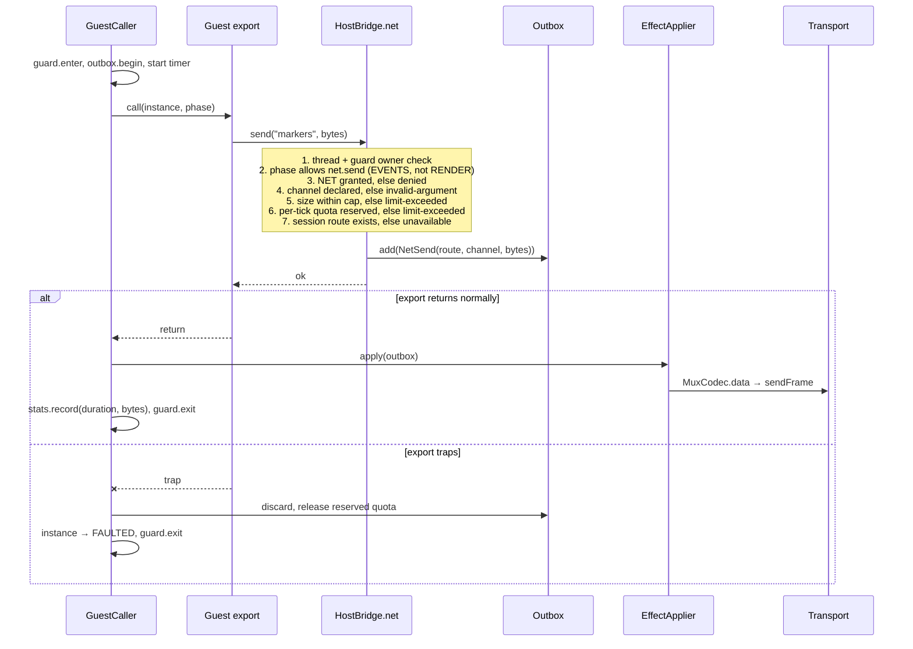
```mermaid
sequenceDiagram
  participant GC as GuestCaller
  participant G as Guest export
  participant HB as HostBridge.net
  participant OB as Outbox
  participant EA as EffectApplier
  participant T as Transport

  GC->>GC: guard.enter, outbox.begin, start timer
  GC->>G: call(instance, phase)
  G->>HB: send("markers", bytes)
  Note over HB: 1. thread + guard owner check<br/>2. phase allows net.send (EVENTS, not RENDER)<br/>3. NET granted, else denied<br/>4. channel declared, else invalid-argument<br/>5. size within cap, else limit-exceeded<br/>6. per-tick quota reserved, else limit-exceeded<br/>7. session route exists, else unavailable
  HB->>OB: add(NetSend(route, channel, bytes))
  HB-->>G: ok
  alt export returns normally
    G-->>GC: return
    GC->>EA: apply(outbox)
    EA->>T: MuxCodec.data → sendFrame
    GC->>GC: stats.record(duration, bytes), guard.exit
  else export traps
    G--xGC: trap
    GC->>OB: discard, release reserved quota
    GC->>GC: instance → FAULTED, guard.exit
  end
```

The outbox has four properties.

- **Validation happens when the guest calls.** The guest receives a precise `host-error` and can react to it. Applying the outbox after the export returns cannot fail because of the guest. It can fail only for platform reasons, such as a closed connection. Those failures are logged and counted and are not reported to the guest.
- **Effects are atomic per call.** If an export traps, none of its effects happen.
- **One place enforces policy.** Permission, quota, rate limit, and failure handling all live in `HostBridge` and `EffectApplier`.
- **The outbox is the completion point for asynchronous work.** If exports later become asynchronous, staged effects need no change of meaning.

### 18.3 Call phases

| Phase | Export | Allowed imports |
|---|---|---|
| `INIT` | `init` | `log`, `view` (may return `unavailable`), `net.max-payload` |
| `EVENTS` | `handle-events` | All granted imports |
| `RENDER` | `render` | `log`, `view`, `hud`. `net.send` is not allowed, because rendering does not produce traffic. |
| `SHUTDOWN` | `shutdown` | `log`, `net.send` (best-effort flush) |

An import called from a phase that does not allow it returns `host-error.unavailable`. It does not trap.

---

## 19. Catalog and instance ownership

### 19.1 Ownership tree

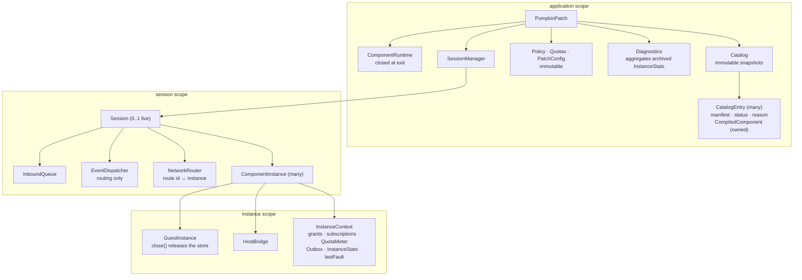
```mermaid
flowchart TB
  subgraph APP["application scope"]
    H["PumpkinPatch"]
    H --> RT["ComponentRuntime<br/>closed at exit"]
    H --> CAT["Catalog<br/>immutable snapshots"] --> CE["CatalogEntry (many)<br/>manifest · status · reason<br/>CompiledComponent (owned)"]
    H --> CFG["Policy · Quotas · PatchConfig<br/>immutable"]
    H --> DG["Diagnostics<br/>aggregates archived InstanceStats"]
    H --> SM["SessionManager"]
  end
  subgraph SES["session scope"]
    S["Session (0..1 live)"]
    S --> IQ["InboundQueue"]
    S --> ED["EventDispatcher<br/>routing only"]
    S --> NR["NetworkRouter<br/>route id ↔ instance"]
    S --> CI["ComponentInstance (many)"]
  end
  subgraph INS["instance scope"]
    GI["GuestInstance<br/>close() releases the store"]
    HB["HostBridge"]
    IC["InstanceContext<br/>grants · subscriptions · QuotaMeter<br/>Outbox · InstanceStats · lastFault"]
  end
  SM --> S
  CI --> GI
  CI --> HB
  CI --> IC
```

### 19.2 Responsibilities

| Concern | Owner |
|---|---|
| Manifest, discovery results, validation verdicts, compiled artifact | `CatalogEntry` in `Catalog` |
| Lifecycle state and fault state | `ComponentInstance` |
| Grants, subscriptions, quotas, statistics, outbox | `InstanceContext` |
| Which instances receive which events | `EventDispatcher`, which reads `InstanceContext.subscriptions` |
| Route id and channel to instance mapping | `NetworkRouter` |
| The one live session | `SessionManager` |

A central registry that owned all of these would accumulate every new feature and become the object that everything depends on. Pumpkin Patch has no such object. Each concern has one owner, and no owner reaches into another's state.

### 19.3 Closing a session

`Session.close()` runs these steps in order:

1. Stop accepting inbound frames (`router.detach`).
2. Deliver `session-ending` to `ACTIVE` instances in a final drain, if the game is still running.
3. For each instance, in reverse order:
   1. Move to `CLOSING`, call `shutdown()` if applicable, and apply the outbox on a best-effort basis.
   2. Call `GuestInstance.close()` to release the store.
   3. Call `InstanceContext.close()` to archive statistics into `Diagnostics`.
   4. Move to `CLOSED`.
4. Clear the router, the dispatcher, and the inbound queue.

Each object closes what it owns, so no subsystem needs to reach into another to clean up.

---

## 20. WIT architecture

### 20.1 Package layout

Pumpkin Patch defines two WIT packages. **`pumpkin:base`** holds value types that are shared across worlds. **`pumpkin:client`** holds the interfaces and the world that client components target. The server world remains `pumpkin:plugin`, which the Pumpkin server owns.

Interfaces, and not packages, are the unit of granularity. A package is versioned as a whole, so splitting the client API into many packages multiplies the number of version combinations that a component and a host have to agree on. Capabilities are keyed by interface (section 22), so the interface boundary is already where finer control is applied. A package is split only when two of its interfaces evolve at clearly different speeds.

| Package | Contents | Owner |
|---|---|---|
| `pumpkin:base` | `types`: `uuid`, `vec3`, `host-error` | Pumpkin, shared by client and server worlds |
| `pumpkin:client` | `model`, `log`, `view`, `net`, `hud`, `guest`, and the world `client-mod` | Pumpkin Patch |
| `pumpkin:plugin` | The existing server world | Pumpkin server |

### 20.2 Relationship to the server world

Client and server components communicate through the wire protocol in section 23, and not through shared WIT interfaces. The server world is asynchronous from `pumpkin:plugin@0.2.0`, and the client world is synchronous, so a shared interface would have to make the same call blocking on one side and suspendable on the other. Only `pumpkin:base` is common ground. Whether `pumpkin:plugin` adopts the `pumpkin:base` types is open (OQ-7). The server-side interface through which a server component sends to a client component is also open (OQ-3). The mux wire format in section 23 does not depend on either answer.

### 20.3 The `pumpkin:base@0.1.0` and `pumpkin:client@0.1.0` packages

The following is the normative shape of the v0 packages.

```wit
// wit/base/types.wit
package pumpkin:base@0.1.0;

interface types {
    record uuid { most: s64, least: s64 }
    record vec3 { x: f64, y: f64, z: f64 }

    /// Expected host failures. Traps are reserved for guest bugs and runtime failure.
    variant host-error {
        denied,
        invalid-argument(string),
        unavailable,
        stale, // reserved for a future import that accepts a world or resource reference
        limit-exceeded(string),
    }
}
```

```wit
// wit/client/*.wit
package pumpkin:client@0.1.0;

interface model {
    use pumpkin:base/types@0.1.0.{uuid, vec3};

    /// A world as seen during one epoch of one session.
    record world-ref { dimension: string, epoch: u32 }

    record player-snapshot {
        id: uuid, name: string, pos: vec3,
        yaw: f32, pitch: f32, health: f32,
        %world: world-ref,
    }
    record entity-snapshot { id: uuid, kind: string, pos: vec3 }
}

interface log {
    enum level { trace, debug, info, warn, error }
    log: func(level: level, message: string);
}

interface view {
    use pumpkin:base/types@0.1.0.{host-error};
    use model.{player-snapshot, entity-snapshot, world-ref};

    local-player: func() -> result<player-snapshot, host-error>;
    current-world: func() -> result<world-ref, host-error>;
    /// Batched: one call returns up to `max` entities within `radius` of the player.
    nearby-entities: func(radius: f64, max: u32) -> result<list<entity-snapshot>, host-error>;
}

interface net {
    use pumpkin:base/types@0.1.0.{host-error};
    /// Staged. The message is sent after the current export returns.
    send: func(channel: string, payload: list<u8>) -> result<_, host-error>;
    max-payload: func() -> u32;
}

interface hud {
    use pumpkin:base/types@0.1.0.{host-error};
    /// Batched text measurement. Allowed in the render phase only.
    measure-text: func(texts: list<string>) -> result<list<u32>, host-error>;
}

/// Everything the host calls. Every client component exports this interface.
interface guest {
    use model.{world-ref};

    flags event-kinds { tick, %world, input }

    record session-info { session-id: u64, pumpkin-server: bool, net-negotiated: bool }
    record init-info { session: session-info, mod-version: string, host-version: string }
    record init-result { subscriptions: event-kinds }

    record tick-info { game-tick: u64 }
    record net-message { channel: string, payload: list<u8> }
    record action-event { action: string, pressed: bool }

    variant event {
        session-started(session-info),
        world-changed(world-ref),
        tick(tick-info),
        net-message(net-message),
        action(action-event),
        session-ending,
    }

    record frame-info { gui-width: u32, gui-height: u32, game-tick: u64 }
    record text-cmd { x: s32, y: s32, text: string, argb: u32, shadow: bool }
    record rect-cmd { x: s32, y: s32, w: u32, h: u32, argb: u32 }
    variant draw-command { text(text-cmd), fill-rect(rect-cmd) }
    variant frame-output { unchanged, clear, commands(list<draw-command>) }

    init: func(info: init-info) -> result<init-result, string>;
    handle-events: func(events: list<event>);
    render: func(frame: frame-info) -> frame-output;
    shutdown: func();
}

world client-mod {
    import log;
    import view;
    import net;
    import hud;
    export guest;
}
```

Every component exports all of `guest`. A component that does not draw returns `unchanged` from `render`, and language SDKs provide defaults for the exports a component does not need. Pumpkin Patch calls `render` only on instances that hold the `hud` capability.

The world describes the host interfaces that a component may import. The component binary may omit imports it does not use, depending on its toolchain. The host provides every interface required by the declared world; capabilities are decided by grants and not by whether an unused import survives compilation (section 22).

### 20.4 Conventions for the API

1. **Flat records, string kinds.** The API does not mirror Minecraft's class hierarchy. An entity has a `kind` such as `"minecraft:zombie"` and does not have a subtype.
2. **Batched queries.** Every query takes and returns lists.
3. **Staged mutations.** Every mutating call is staged in the outbox and returns `result<_, host-error>`.
4. **Errors are results.** Wherever the host can refuse a call, the function returns `result<T, host-error>`. A trap is reserved for a defect in the component or a failure of the runtime.
5. **New event kinds are new variant cases.** This is a breaking change and follows the release rules in section 21.
6. **Resources only for owned objects.** A resource represents a host-owned object that has to be released, such as a texture or a screen.

---

## 21. WIT versioning and binders

### 21.1 Identity

An interface's WIT id, for example `pumpkin:client/net@0.1.0`, identifies that interface at the component boundary. Pumpkin Patch stores interface ids as strings (`InterfaceId`). The `WorldId` is the manifest's declared target, selected against a supported binder and checked by validating the binary's imports, exports, and types against that world. A compiled component does not have to preserve the source WIT world's name. Java identifiers that bindgen generates may be sanitized, and they are never used to derive a linking name.

Each supported version of `pumpkin:client` has its own binder package, for example `binder/v0_1` and `binder/v0_2`. The package name is a convention of Pumpkin Patch. The interface WIT ids remain the linking identities.

### 21.2 Release rules

Before 1.0:

1. A release of `pumpkin:client` is `0.N.0` for a new minor and `0.N.P` for a patch. A minor release may break compatibility. A patch release must remain compatible with every earlier `0.N.x` release, so that a component built against `0.1.0` links against a host that provides `0.1.2`.
2. A released version's WIT files do not change.
3. `pumpkin:client@0.N` depends on `pumpkin:base@0.N`, and both are released together.
4. A host supports the current minor version and the previous one.
5. A component built for an older minor version is rejected with `UNSUPPORTED_WORLD`. The message names the versions the host supports.

From 1.0, semantic versioning applies: a minor release only adds, and a major release may break.

### 21.3 Binder flow

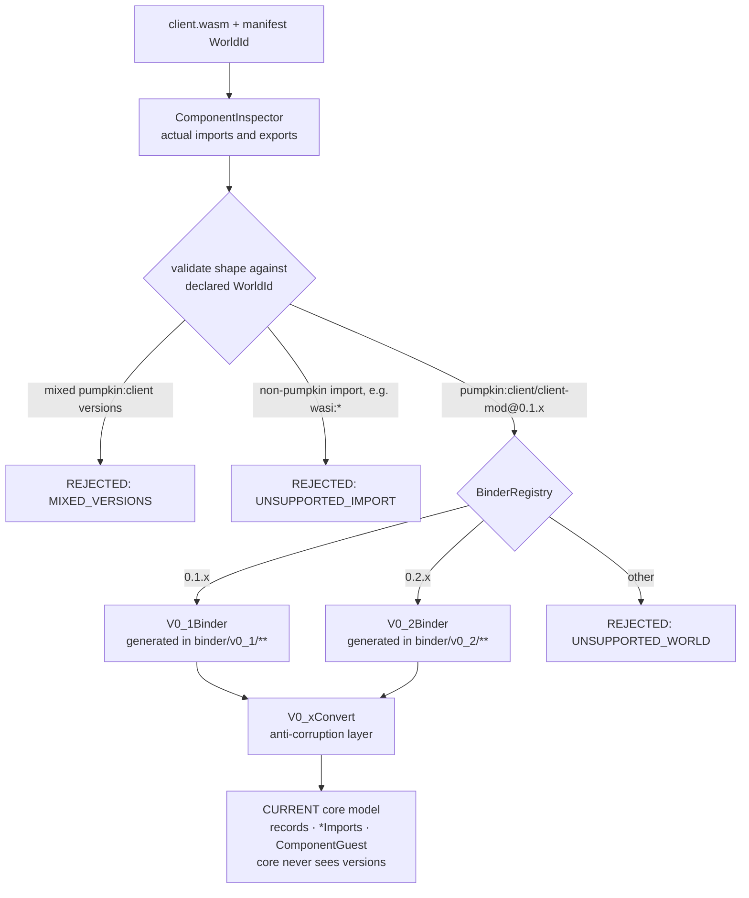
```mermaid
flowchart TB
  W["client.wasm + manifest WorldId"] --> CI["ComponentInspector<br/>actual imports and exports"]
  CI --> D{"validate shape against<br/>declared WorldId"}
  D -->|"mixed pumpkin:client versions"| R1["REJECTED: MIXED_VERSIONS"]
  D -->|"non-pumpkin import, e.g. wasi:*"| R2["REJECTED: UNSUPPORTED_IMPORT"]
  D -->|"pumpkin:client/client-mod@0.1.x"| BR{"BinderRegistry"}
  BR -->|"0.2.x"| B2["V0_2Binder<br/>generated in binder/v0_2/**"]
  BR -->|"0.1.x"| B1["V0_1Binder<br/>generated in binder/v0_1/**"]
  BR -->|"other"| R3["REJECTED: UNSUPPORTED_WORLD"]
  B1 --> C["V0_xConvert<br/>anti-corruption layer"]
  B2 --> C
  C --> CM["CURRENT core model<br/>records · *Imports · ComponentGuest<br/>core never sees versions"]
```

`ComponentInspector` reads the imports and exports of the compiled component. It validates them against the world named in the manifest, including interface versions and structural types; it does not infer a source world name from the binary. All `pumpkin:client` ids in one component must share a minor version. `BinderRegistry` selects the binder for the declared minor version. Compatibility logic exists in exactly one place: the binders.

### 21.4 Adapting older versions

A binder for an older version maps that version's wire shapes onto the current core model.

- **Exports.** The binder converts current `Event` values to the older variant. Event kinds that the older version lacks are dropped and counted in `events.dropped.unsupported`. The current `FrameInfo` is converted to the older shape.
- **Imports.** The binder adapts older import signatures to the current `*Imports` calls. A function that no longer exists in core is implemented in the binder by returning `unavailable`.

If an older version cannot be adapted faithfully, it leaves the support window early, and `wit/CHANGELOG.md` records why.

### 21.5 Negotiation

The handshake (section 24) carries world ids as strings. `core` compares them without knowing that any binder exists. `CapabilityResolver` receives the imported `InterfaceId` values as strings.

### 21.6 WASI

Components may not import WASI interfaces in v0, and any WASI import is rejected with a message that says so. Some language toolchains produce components that import a small WASI subset. Which subset, if any, Pumpkin Patch provides depends on the languages of the first SDKs (OQ-4).

---

## 22. Capability and security model

### 22.1 Security boundary

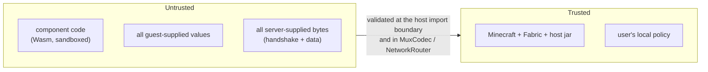
```mermaid
flowchart LR
  subgraph UN["Untrusted"]
    u1["component code<br/>(Wasm, sandboxed)"]
    u2["all guest-supplied values"]
    u3["all server-supplied bytes<br/>(handshake + data)"]
  end
  subgraph TR["Trusted"]
    t1["Minecraft + Fabric + host jar"]
    t2["user's local policy"]
  end
  UN -->|"validated at the host import boundary<br/>and in MuxCodec / NetworkRouter"| TR
```

Installing a component is consent to run it with the capabilities it requests. It is not permission to exceed them.

**Distribution.** Components are installed by the user into `<gameDir>/pumpkin-mods/`. A server can declare the components and versions it requires. It cannot deliver, download, enable, or grant capabilities to any component. Server-assisted distribution needs its own design for signing, provenance, and consent, and is deferred (DD-7).

**Integrity.** The manifest records the `sha256` of each component. A mismatch rejects the mod with `HASH_MISMATCH`. The hash protects integrity and does not authenticate the author. Signing is deferred.

**Sandbox.** A component has no ambient authority. It has no filesystem, network, environment, process, or clock access beyond the `tick-info` it receives. It can call only the interfaces that Pumpkin Patch links.

### 22.2 Capabilities

A capability is a grant to use one host interface. The set is small and fixed.

| Capability | Covers | Sensitive |
|---|---|---|
| `log` | The `log` interface. Always granted. | No |
| `view` | The `view` interface | No |
| `net` | The `net` interface and delivery of `net-message` | No |
| `hud` | The `hud` interface, and Pumpkin Patch calling `render` | No |
| `input` | Delivery of `action` events and registration of manifest key bindings | No |
| `clipboard`, `open-url`, `http`, `filesystem`, `intercept` (future) | Reserved | **Yes**, never granted by default |

There are no function-level grants and no resource ACLs. Finer limits are quotas and validation inside an interface, such as the declared channel names, size limits, and call phases. A per-function permission would require every function to have a name that users understand and a policy that someone maintains, and neither is likely to be kept up.

### 22.3 Resolution

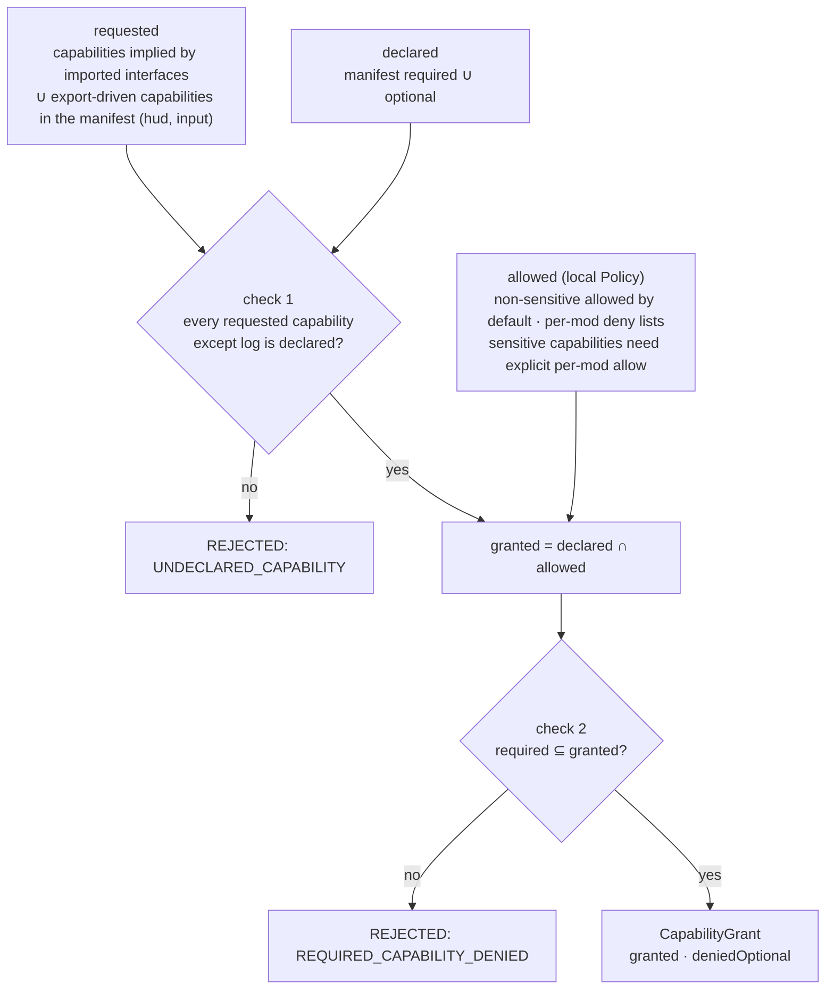
```mermaid
flowchart TB
  REQ["requested<br/>capabilities implied by imported interfaces<br/>∪ export-driven capabilities in the manifest (hud, input)"]
  DEC["declared<br/>manifest required ∪ optional"]
  POL["allowed (local Policy)<br/>non-sensitive allowed by default · per-mod deny lists<br/>sensitive capabilities need explicit per-mod allow"]
  REQ --> C1{"check 1<br/>every requested capability<br/>except log is declared?"}
  DEC --> C1
  C1 -->|no| X1["REJECTED: UNDECLARED_CAPABILITY"]
  C1 -->|yes| G["granted = declared ∩ allowed"]
  POL --> G
  G --> C2{"check 2<br/>required ⊆ granted?"}
  C2 -->|no| X2["REJECTED: REQUIRED_CAPABILITY_DENIED"]
  C2 -->|yes| OK["CapabilityGrant<br/>granted · deniedOptional"]
```

`CapabilityResolver` is a pure function of its three inputs and is unit-tested directly.

### 22.4 Denied capabilities at runtime

A component links against every import in its world. For an optional capability that the user denied, Pumpkin Patch still links the interface, and `HostBridge` answers each call with `host-error.denied`. The component does not trap. It receives a result it can handle. This is why every function in a gated interface returns `result<_, host-error>`.

### 22.5 Server policy

A server cannot grant or revoke a client capability. It can mark a component *required*, which causes the join to be refused if the component is missing, incompatible, or rejected locally, or *optional*. A required component whose required capabilities the user denied counts as unavailable, and the handshake reports it (section 24). `AVAILABLE` means the component has been validated and compiled; it does not guarantee that a later `init` or callback will succeed. If a required component faults after acceptance, Pumpkin Patch sends `CLOSE` and the server applies its required-mod policy, including disconnecting the player if continued operation would be invalid.

---

## 23. Networking architecture

### 23.1 One multiplexed channel

All mod traffic travels over a single custom payload type, `pumpkin:mux`. The payload contains a small frame, and the frame carries opaque bytes for one component's channel.

A separate payload type per component would be the alternative. Minecraft requires payload types to be registered with a codec on both ends at startup, so a dynamic set of component channels does not fit the platform. Each new mod would also have to be known to the Fabric registration and to the server. One multiplexed channel needs one registration, lets components be added without changing it, and gives the Pumpkin server one protocol to implement. The cost is that Pumpkin owns a small framing format and a router.

Payloads are opaque to Pumpkin. The client and server components of a mod share their own codec, and Pumpkin does not parse or version it.

### 23.2 Network flow

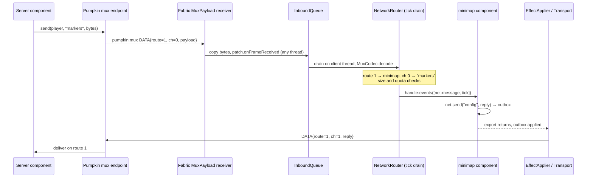
```mermaid
sequenceDiagram
  participant SC as Server component
  participant SM as Pumpkin mux endpoint
  participant FR as Fabric MuxPayload receiver
  participant Q as InboundQueue
  participant R as NetworkRouter (tick drain)
  participant G as minimap component
  participant EA as EffectApplier / Transport

  SC->>SM: send(player, "markers", bytes)
  SM->>FR: pumpkin:mux DATA{route=1, ch=0, payload}
  FR->>Q: copy bytes, patch.onFrameReceived (any thread)
  Q->>R: drain on client thread, MuxCodec.decode
  Note over R: route 1 → minimap, ch 0 → "markers"<br/>size and quota checks
  R->>G: handle-events([net-message, tick])
  G->>G: net.send("config", reply) → outbox
  G-->>EA: export returns, outbox applied
  EA->>SM: DATA{route=1, ch=1, reply}
  SM->>SC: deliver on route 1
```

### 23.3 Wire format, version 1

Integers are Minecraft VarInts unless noted. A string is a VarInt length followed by UTF-8 bytes.

```text
frame        := frame-type:VarInt  body
frame-type   := 0 HELLO (S→C) | 1 REPLY (C→S) | 2 ACCEPT (S→C) | 3 DATA (both) | 4 CLOSE (both)

HELLO  := mux-version:VarInt
          server-id:String                         // informational, e.g. "Pumpkin 0.x"
          count:VarInt { mod-id:String  version-req:String  world-id:String
                         requirement:Byte(0 optional, 1 required)
                         protocol:String            // mod-owned opaque token, e.g. "minimap/3"
                         channel-count:VarInt { channel:String } }
REPLY  := mux-version:VarInt
          count:VarInt { mod-id:String  status:Byte  version:String  detail:String }
          // status: 0 AVAILABLE, 1 MISSING, 2 INCOMPATIBLE_VERSION, 3 INCOMPATIBLE_WORLD,
          //         4 INCOMPATIBLE_PROTOCOL, 5 REJECTED_LOCALLY, 6 DISABLED_BY_USER
ACCEPT := outcome:Byte(0 JOIN, 1 REFUSE)  message:String
          count:VarInt { mod-id:String  route-id:VarInt }       // route ids for active mods
DATA   := route-id:VarInt  channel-index:VarInt  payload:rest-of-frame
CLOSE  := route-id:VarInt  reason:String            // one side stops a mod's traffic
```

A **channel index** is the position of a channel in the list that `HELLO` sent for that mod. The client checks that list against the channels in the manifest, and a channel the manifest does not declare makes the mod `INCOMPATIBLE_PROTOCOL`. A **route id** is assigned by the server in `ACCEPT`, is local to the session, and is not reused within it. A `DATA` frame contains neither a mod id nor a channel name, so the common case is two small VarInts followed by the payload.

### 23.4 Limits and validation

| Check | Performed by | On failure |
|---|---|---|
| The frame decodes | `MuxCodec` | The frame is dropped and `net.malformed` is incremented. Repeated failures in one tick log a warning about the server or network, and not about a component. |
| The route is known | `NetworkRouter` | Dropped and counted. |
| Inbound payload is at most `maxInboundPayload` | `NetworkRouter` | Dropped and counted against the route. |
| The instance queue has room | `NetworkRouter` | The oldest event is dropped and `events.dropped.overflow` is incremented. |
| Outbound payload is at most `maxOutboundPayload` | `HostBridge.net.send` | `limit-exceeded`. |
| Outbound bytes and messages per tick are within quota | `QuotaMeter` | `limit-exceeded`. |
| The transport frame is within the platform limit | `FabricMuxTransport` | A bug in Pumpkin Patch. The limits above are derived from the platform limit so that this does not occur. |

Minecraft limits the size of a custom payload, and the limit differs by direction, with serverbound payloads allowed to be much smaller than clientbound ones. `maxOutboundPayload` defaults to the smaller of 16 KiB and the serverbound limit minus the frame header. `maxInboundPayload` defaults to 64 KiB. The exact platform limits for the target version are recorded under OQ-2.

### 23.5 What the Pumpkin server provides

The Pumpkin server needs to provide the `pumpkin:mux` channel, send `HELLO` and process `REPLY` and `ACCEPT`, route `DATA` frames to server components, and offer server components an API to send to the client component of a player. The Pumpkin side of this is tracked in OQ-2 and OQ-3.

---

## 24. Handshake and negotiation

### 24.1 Sequence

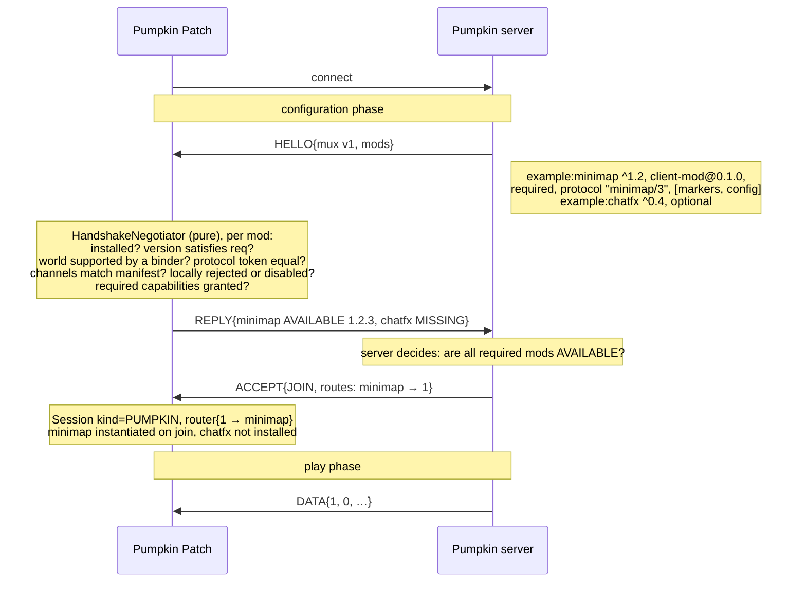
```mermaid
sequenceDiagram
  participant C as Pumpkin Patch
  participant S as Pumpkin server

  C->>S: connect
  Note over C,S: configuration phase
  S->>C: HELLO{mux v1, mods}
  Note right of S: example:minimap ^1.2, client-mod@0.1.0,<br/>required, protocol "minimap/3", [markers, config]<br/>example:chatfx ^0.4, optional
  Note over C: HandshakeNegotiator (pure), per mod:<br/>installed? version satisfies req?<br/>world supported by a binder? protocol token equal?<br/>channels match manifest? locally rejected or disabled?<br/>required capabilities granted?
  C->>S: REPLY{minimap AVAILABLE 1.2.3, chatfx MISSING}
  Note over S: server decides: are all required mods AVAILABLE?
  S->>C: ACCEPT{JOIN, routes: minimap → 1}
  Note over C: Session kind=PUMPKIN, router{1 → minimap}<br/>minimap instantiated on join, chatfx not installed
  Note over C,S: play phase
  S->>C: DATA{1, 0, …}
```

The client reports what is installed, validated, compiled, and locally permitted; the server decides whether those facts satisfy its requirements. `AVAILABLE` does not mean a guest has successfully initialized: instantiation and `init` happen after `ACCEPT`. An initialization failure sends `CLOSE` for the assigned route, and the server decides whether a required-mod failure disconnects the player. Policy therefore lives in one place, and server operators can write a clear refusal message.

### 24.2 Outcomes

| Situation | Server `ACCEPT` | Client behavior |
|---|---|---|
| All required mods `AVAILABLE` | `JOIN` with routes | The negotiated components receive `net` and begin initialization. A later fault is reported with `CLOSE`; the server may disconnect for a required mod. |
| An optional mod is not `AVAILABLE` | `JOIN` without its route | The component is `DORMANT` if its activation is `pumpkin-server`. If its activation is `always`, it runs and `net` returns `unavailable`. |
| A required mod is not `AVAILABLE` | `REFUSE` with a message | The client shows the server's message and the local reason, for example "example:minimap 1.1.0 is installed, the server requires ^1.2", and disconnects. |
| The client does not support `mux-version` | none | The client reports its highest supported mux version if the envelope is decodable; otherwise the connection fails with a protocol-version error. The server decides whether to disconnect. |
| No `HELLO` arrives before join | none | The session is `NON_PUMPKIN`, and only components with `activation = "always"` run. |

### 24.3 Phase

The preferred phase is configuration, because a refusal then occurs before the world loads. If a server sends `HELLO` during play instead, the same exchange runs there. Components with `pumpkin-server` activation are then instantiated when `ACCEPT` arrives, and a refusal is a server-initiated disconnect after the join. Pumpkin Patch registers `pumpkin:mux` for both phases, since Fabric keeps separate configuration and play payload registries. Whether the target Pumpkin and Fabric versions require the channel to be announced before sending is recorded under OQ-2.

### 24.4 Timeout

After sending `REPLY`, the client waits at most `handshakeTimeoutMillis` for `ACCEPT`, which defaults to 10 seconds. A timeout after `HELLO` is a failed Pumpkin handshake and ends the connection with a diagnostic; it must not be reclassified as a non-Pumpkin server. Only a connection that never sent `HELLO` can enter the `NON_PUMPKIN` path.

---

## 25. Manifest format and semantics

### 25.1 Format

A mod's manifest is a sidecar TOML file named `pumpkin-mod.toml`, placed beside its components. A sidecar can be read and validated without parsing WebAssembly. It can be edited without rebuilding a component. It is also needed before compilation, because key bindings are registered during initialization. TOML matches the Rust and Cargo conventions that Pumpkin authors already use and allows comments. Parsing is isolated in `ManifestParser`, so a change of syntax is a local change.

Server components keep the metadata that Pumpkin's server ABI defines inside the component. The `[server]` table in the manifest is informational for the client and for packaging tools.

### 25.2 Layout on disk

```text
<gameDir>/pumpkin-mods/
├── example-minimap/
│   ├── pumpkin-mod.toml
│   └── client.wasm
└── example-chatfx/
    ├── pumpkin-mod.toml
    └── client.wasm
```

Zip packaging is deferred (DD-8).

### 25.3 Schema, manifest-version 1

```toml
manifest-version = 1                        # required; unknown versions are rejected

[mod]
id          = "example:minimap"             # required; namespace:path, [a-z0-9_.-]
name        = "Minimap"                     # required
version     = "1.2.3"                       # required; semver
description = "A small minimap."
authors     = ["Alex"]
license     = "MIT"

[client]
component   = "client.wasm"                 # required if [client] is present
sha256      = "9f2c…"                       # required
world       = "pumpkin:client/client-mod@0.1.0"   # required; binary must match this world's shape
activation  = "pumpkin-server"              # "always" | "pumpkin-server"; default "pumpkin-server"

[client.capabilities]
required = ["view", "hud"]
optional = ["net", "input"]

[client.net]
protocol = "minimap/3"                      # opaque; must equal the server's token
channels = ["markers", "config"]            # order is irrelevant; names match [a-z0-9_-]{1,32}

[[client.actions]]                          # requires the "input" capability
id          = "toggle"                      # delivered as action id "toggle"
title       = "Toggle minimap"
default-key = "key.keyboard.m"              # Minecraft key translation id

[server]                                    # informational on the client
component = "server.wasm"
```

### 25.4 Validation

| Rule | Failure |
|---|---|
| `manifest-version` is known | `REJECTED: UNSUPPORTED_MANIFEST` |
| `id` is unique in the catalog | Both entries: `REJECTED: DUPLICATE_ID` |
| `sha256` matches the file | `REJECTED: HASH_MISMATCH` |
| `world` has a binder | `REJECTED: UNSUPPORTED_WORLD` |
| The binary's imports, exports, and types match the declared `world` | `REJECTED: WORLD_MISMATCH` |
| Imported interfaces are covered by declared capabilities | `REJECTED: UNDECLARED_CAPABILITY` |
| `[[client.actions]]` present implies `input` is declared | `REJECTED: INVALID_MANIFEST` |
| A `dependencies` key is present | `REJECTED: UNSUPPORTED_FEATURE` (the key is reserved) |

There are no dependencies between mods in v0. Components cannot import each other or discover each other, and mods that need to cooperate do so through their servers. This removes load-order graphs, cycle handling, and cascading failure. Dependencies are added only for a concrete use case (DD-5).

---

## 26. Resource and value model

| Concept | Representation in v0 | Reason |
|---|---|---|
| Player | `player-snapshot` value | A snapshot cannot go stale during a call and needs no cleanup. |
| Entity | `entity-snapshot` value, retrieved in batches by `nearby-entities` | Entities despawn within ticks, and a handle would be stale often. |
| World | `world-ref { dimension, epoch }` value | The epoch detects a stale reference with one integer comparison. |
| Screen | Not in v0 | A large design surface (DD-2). |
| Texture | Not in v0. A resource when added. | A host-owned object that has to be released. |
| Network channel | A declared `string` name | Its lifetime is the session, and there is nothing to release. |
| Subscription | A `flags` value returned from `init` | Fixed per instance, so no handle is needed. |
| Scheduled task | Not in v0 | A guest counts `tick` events. SDKs provide timer helpers. |

A resource added later has an owner, which is one instance. Pumpkin Patch drops every resource of an instance in `InstanceContext.close()`. A resource carries an epoch or session tag, so that use after a world change returns `stale`. A fixture that exercises the resource shape precedes its use in the API.

---

## 27. Rendering architecture

### 27.1 Scope

| Area | v0 | Later |
|---|---|---|
| **HUD**, a 2D overlay in GUI coordinates | `render` returns a command list of `text` and `fill-rect` | `draw-texture` with a texture resource, `draw-item` by item id, clipping |
| **World rendering**, 3D geometry in the world | None | A separate design, likely with its own capability and export |
| **Custom screens** | None | A separate design. It is not a widget toolkit in WIT. |

### 27.2 Render model

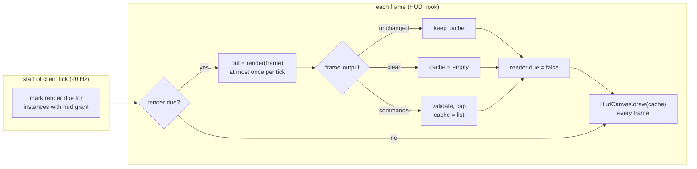
```mermaid
flowchart LR
  subgraph TICK["start of client tick (20 Hz)"]
    t1["mark render due for<br/>instances with hud grant"]
  end
  subgraph FRAME["each frame (HUD hook)"]
    direction TB
    f1{"render due?"}
    f2["out = render(frame)<br/>at most once per tick"]
    f3{"frame-output"}
    f5["keep cache"]
    f6["cache = empty"]
    f7["validate, cap<br/>cache = list"]
    f8["render due = false"]
    f9["HudCanvas.draw(cache)<br/>every frame"]
    f1 -->|yes| f2 --> f3
    f3 -->|unchanged| f5 --> f8
    f3 -->|clear| f6 --> f8
    f3 -->|commands| f7 --> f8
    f8 --> f9
    f1 -->|no| f9
  end
  t1 --> f1
```

Pumpkin Patch calls `render` at most once per instance per client tick, which is 20 times per second. It draws the cached command list every frame. A HUD component therefore updates at tick rate in v0. A call per frame at 144 frames per second would dominate the cost of running components, and `frame-output.unchanged` makes a component that has nothing new to draw nearly free. Sub-tick interpolation is deferred (DD-1).

The host validates each command list. The number of commands is capped at `maxDrawCommands` (default 512) and the excess is truncated and counted. Text length is capped, and coordinates are clamped. Instances draw in stable order, and commands within an instance keep their order.

The render hook stays thin. `FabricHudCanvas` maps commands to the Minecraft draw context and does nothing else.

---

## 28. Input architecture

Components see logical actions and not raw input. A mod declares its actions in the manifest (`[[client.actions]]`). During client initialization the Fabric adapter registers one Minecraft key binding for each, which is when Fabric expects key bindings to be registered. This is why the catalog reads manifests synchronously at startup. Players rebind keys in the standard controls screen, where the bindings appear under a "Pumpkin Patch" category with the mod's name.

On each tick, `TickHook` reads the pressed and released transitions of the bindings and enqueues `action(id, pressed)` events. They arrive in the tick batch of instances that subscribed to `input`. A key binding whose `input` capability was denied is still registered, because registration happens before policy is final, and it delivers nothing.

Input is notification-only in v0. A component cannot consume, cancel, or suppress an input. Raw key and mouse events, text input, and cancellable input are deferred (DD-3, DD-4).

---

## 29. Failure isolation

### 29.1 What is isolated

Components run inside one JVM, so isolation has limits. The table separates what Pumpkin Patch isolates from what it cannot.

| Isolated | Not isolated |
|---|---|
| Linear memory and state: each instance has its own store. | Bugs in the runtime that affect every instance. |
| Traps: a trap ends one call and faults one instance. | `OutOfMemoryError` and garbage-collection pressure from host-side allocations, which all components share. |
| Host-side effects: the outbox of a failed call is discarded. | Time spent inside a call, which is bounded by the call budget and not by preemption of the whole client. |
| CPU time per call: an exhausted budget interrupts the call (requirement R4). | |
| Quotas: they apply per instance. | |

### 29.2 Failure behavior

| Failure | Detected by | Result | Effect on other components |
|---|---|---|---|
| Manifest invalid, hash mismatch, unsupported world, undeclared capability | `CatalogLoader` | `REJECTED`. The reason appears in `/pumpkinpatch list` and in the log. | None |
| Compile error | `ComponentRuntime.compile` | `REJECTED: COMPILE_ERROR` | None |
| Instantiation failure | `CompiledComponent.instantiate` | `FAULTED` | None |
| Trap in `init` | `GuestCaller` | `FAULTED`. The store is released and the instance never becomes `ACTIVE`. | None |
| `init` returns `err(message)` | `GuestCaller` | `FAULTED` with reason `INIT_ERROR` | None |
| Trap in `handle-events` or `render` | `GuestCaller` | The outbox is discarded, the instance is `FAULTED`, its queued events are dropped, and a `CLOSE` frame is sent for its route. | None. The remaining instances are called next in the same drain. |
| Call budget exhausted | Runtime interruption, reported by `GuestCaller` | `FAULTED: TIMEOUT` | None |
| Memory limit exceeded | Runtime, reported as a trap | `FAULTED: MEMORY_LIMIT` | None |
| Invalid argument to a host import | `HostBridge` | `host-error.invalid-argument` is returned and counted. | None |
| Denied capability used | `HostBridge` | `host-error.denied` | None |
| Unsupported WIT version | `BinderRegistry` | `REJECTED: UNSUPPORTED_WORLD` | None |
| Malformed inbound frame | `MuxCodec` | Dropped and counted as a network or server problem. | None |
| Soft quota exceeded (network bytes, log lines, entity query size) | `QuotaMeter` | `limit-exceeded`, or truncation. The event is counted. | None |
| Hard quota exceeded repeatedly (draw commands beyond ten times the cap) | `QuotaMeter` | `FAULTED: QUOTA` | None |
| Slow calls: `slowCallStrikes` calls above `slowCallMillis` in one session | `GuestCaller` | A warning for each strike, then `FAULTED: TOO_SLOW` | None |
| Bug in Pumpkin Patch: re-entry or wrong thread | Guards | The instance is faulted with a `HOST_*` reason, and the error is logged. | None |
| Unexpected runtime exception | `TrapTranslator` | Treated as a trap of that instance. If it recurs across instances within one tick, Pumpkin Patch disables itself for the session and reports it. | Possibly all |

### 29.3 Fault reporting

A `FaultRecord` contains the mod id, mod version, session id, state, kind, message, an optional guest backtrace, the time, and the phase of the last call. It is written to the log and shown as one toast per fault through `FaultReporter`. `Diagnostics` keeps the last 20 records.

---

## 30. Quotas and resource limits

`Quotas` holds the defaults, and `config/pumpkin-patch.toml` overrides them globally. Per-mod overrides are deferred (DD-9). The defaults are starting values and are tuned by measurement in phase 4 (OQ-8). A per-call timeout protects against a runaway guest but does not establish acceptable frame time for one or many mods.

| Limit | Default | Enforced by | When exceeded |
|---|---|---|---|
| Component file size | 32 MiB | `CatalogLoader` | `REJECTED` |
| Linear memory per instance | 256 MiB | Runtime, through `RuntimeLimits` | The grow fails, the guest traps, and the instance is `FAULTED` |
| Call budget: `handle-events` and `render` | 25 ms provisional safety ceiling, not a frame-time target | Runtime interruption, only after R4 passes | `FAULTED: TIMEOUT` |
| Call budget: `init` | 500 ms | Runtime interruption | `FAULTED: TIMEOUT` |
| Call budget: `shutdown` | 50 ms | Runtime interruption | Recorded, and the instance closes |
| Slow-call threshold and strikes | 10 ms and 3 | `GuestCaller` | A warning, then `FAULTED: TOO_SLOW` |
| Queued events per instance | 1024 | `EventDispatcher` | The oldest event is dropped and counted |
| Events per `handle-events` batch | 256 | `EventDispatcher` | The remainder is delivered on the next tick. The `tick` event always ends the final batch. |
| Inbound payload size | 64 KiB | `NetworkRouter` | Dropped and counted |
| Outbound payload size | At most 16 KiB | `HostBridge.net.send` | `limit-exceeded` |
| Outbound bytes per tick per instance | 32 KiB | `QuotaMeter` | `limit-exceeded` |
| Outbound messages per tick per instance | 64 | `QuotaMeter` | `limit-exceeded` |
| Log lines per tick per instance | 20 lines, 8 KiB | `HostBridge.log` | Dropped, with one "N lines suppressed" line per second |
| `nearby-entities` maximum | 256 | `HostBridge.view` | Clamped |
| Draw commands per render | 512 | Render drain | Truncated and counted |
| Text length per draw command | 256 characters | Render drain | Truncated |
| Mods listed in a handshake | 256 | `MuxCodec` | Malformed frame |

Each exceeded limit increments a named counter in `InstanceStats.quotaViolations`.

---

## 31. Diagnostics and observability

### 31.1 What is recorded

For each instance, `InstanceStats` records:

- the mod id, version, session id, state, and grants
- the number of calls per export, the total and maximum duration per export, and a coarse duration histogram (under 1 ms, under 5 ms, under 20 ms, under 50 ms, and 50 ms or more)
- a rolling average of guest time per tick over the last 100 ticks
- events delivered and events dropped, whether by overflow or because the component's version lacks the event
- network bytes and messages in each direction, and inbound frames that were malformed or dropped
- draw commands submitted and truncated
- quota violations by kind
- the last fault

For the host as a whole, it records catalog statuses and reasons, compile durations, and the total guest time per tick.

### 31.2 Surfaces

Each guest log line is written with the prefix `[pumpkin:<mod-id>]`. Lifecycle transitions log at INFO, and faults log at ERROR. A fault also shows a toast.

The `/pumpkinpatch` command has these subcommands:

| Subcommand | Output |
|---|---|
| `list` | Catalog entries with their status and reason |
| `stats` | A table of instances sorted by average tick time |
| `faults` | Recent fault records |
| `reload <id>` | Reloads one mod. Available only when `developerMode` is enabled. |

When the total guest time in one tick exceeds `slowTickMillis` (default 10 ms), Pumpkin Patch logs the three instances with the largest time, at most once every 10 seconds. This answers the question of which component is causing lag.

`DiagnosticsSnapshot` is an immutable record produced by core. The command and the toast in `fabric` only format it, and tests assert on it directly. There is no metrics exporter in v0.

---

## 32. Testing architecture

### 32.1 Test layers

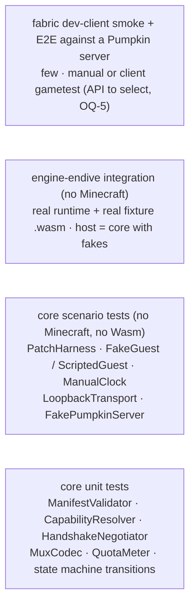
```mermaid
flowchart TB
  L4["fabric dev-client smoke + E2E against a Pumpkin server<br/>few · manual or client gametest (API to select, OQ-5)"]
  L3["engine-endive integration (no Minecraft)<br/>real runtime + real fixture .wasm · host = core with fakes"]
  L2["core scenario tests (no Minecraft, no Wasm)<br/>PatchHarness · FakeGuest / ScriptedGuest · ManualClock<br/>LoopbackTransport · FakePumpkinServer"]
  L1["core unit tests<br/>ManifestValidator · CapabilityResolver · HandshakeNegotiator<br/>MuxCodec · QuotaMeter · state machine transitions"]
  L4 ~~~ L3 ~~~ L2 ~~~ L1
```

The number of tests grows toward the bottom layer. Only the top layer needs Minecraft.

### 32.2 Coverage

| Area | Layer | Method |
|---|---|---|
| Manifest validation | core unit | Table-driven TOML inputs and expected `Problem` values |
| Lifecycle and state machine | core scenario | `ScriptedGuest` returns or traps per call. Tests assert the state sequence. |
| Sessions and epochs | core scenario | Drive `onJoin`, `enqueueWorldChanged`, and `onDisconnect`. A guest sees a new epoch and discards its old world snapshot. |
| Event ordering and batching | core scenario | Enqueue interleavings and assert batch contents and order, with `tick` last. |
| Fault transitions | core scenario and runtime integration | Scripted traps and real trap fixtures |
| Capabilities | core unit and scenario | A resolver matrix, and `denied` observed at runtime |
| Quotas | core scenario | Guests that exceed each limit, with assertions on error codes and counters |
| Network routing | core scenario | `FakePumpkinServer` over `LoopbackTransport` |
| Handshake | core unit and scenario | A negotiator matrix for missing, version, world, protocol, channels, and disabled, plus the full exchange |
| Reentrancy and thread guards | core unit | A guest that calls back illegally, and a call from the wrong thread |
| WIT compatibility | runtime integration | One fixture per supported version, and fixtures for `UNSUPPORTED_WORLD`, `MIXED_VERSIONS`, and `UNSUPPORTED_IMPORT` |
| Multiple components | core scenario and runtime integration | Two to five instances, one of which traps while the others continue |
| Older WIT versions | runtime integration | Fixtures for the previous minor version run through the older binder, with dropped events counted |
| Rendering | core scenario | `RecordingHudCanvas` asserts cached lists, truncation, and `unchanged` |
| Fabric translators | fabric unit | Pure functions with hand-built inputs |

### 32.3 Conformance

Two suites keep the fakes and the runtime honest.

`GuestContractTest` is an abstract JUnit suite that runs against `FakeRuntime` and against `EndiveComponentRuntime` with the `echo` fixture. A behavior that differs between the fake and the real runtime fails one of the two runs.

`RuntimeContractTest` contains one fixture for each requirement in section 11.1.

| Requirement | Fixture and assertion |
|---|---|
| R1 | Compile one component and instantiate it twice. The two instances have independent state. |
| R2 | Compile on one thread and instantiate and call on another. |
| R3 | Two instances of `echo` keep separate memory. Closing one leaves the other running. |
| R4 | In an isolated test process, `spin` loops without end. The call ends in a budget trap near the configured ceiling, and the execution thread remains usable afterward. Repeat for each supported execution engine. |
| R5 | A fixture grows memory beyond the limit. The call ends in a memory-limit trap. |
| R6 | A component built against a package with dependencies links. |
| R7 | A component built against `0.1.0` links against a host that provides `0.1.1`. A component with an incompatible interface type is rejected. |
| R8 | `echo` returns a 64 KiB `list<u8>` byte for byte, and every construct in the `pumpkin:client` package round-trips. |
| R9 | `trap-init`, `spin`, and the memory fixture each report a distinct trap kind. |
| R10 | The complete suite runs without async support. |
| R11 | The dev-client smoke test loads the runtime under Fabric. |

### 32.4 Fixtures

Fixtures are hand-written `.wat` files that implement `client-mod`. `wasm-tools component embed` followed by `wasm-tools component new` turns each into a component.

| Fixture | Behavior |
|---|---|
| `hello` | `init` logs and subscribes to `tick`. |
| `echo` | Echoes every `net-message` on the same channel. |
| `trap-init` | Executes `unreachable` in `init`. |
| `trap-events` | Traps on the Nth `handle-events`. |
| `spin` | Loops without end, to test the call budget. |
| `oversize-send` | Sends payloads above the limit. It traps unless it receives `limit-exceeded`. |
| `denied-net` | Expects `denied` from `net.send`. It traps otherwise. |
| `hud-text` | Returns a fixed command list, then `unchanged`. |
| `wasi-import` | Imports a WASI interface, to test rejection. |

A fixture traps unless it receives the value the test expects, and a companion test asserts the trap. A binding that silently drops a value therefore cannot pass. Realistic components, such as a Rust component built with `cargo component`, are added in phase 6 as SDK samples and are not unit fixtures.

---

## 33. Performance model

### 33.1 Crossings per tick

| Crossing | Count per tick |
|---|---|
| `handle-events` | At most one per `ACTIVE` instance with a non-empty batch |
| `render` | At most one per `ACTIVE` instance with `hud`, and only when due (20 Hz) |
| Host imports | Bounded by quotas. Reads are batched (`nearby-entities`, `measure-text`). |
| Guest calls per frame | **None**. Frames draw cached command lists. |
| Guest calls per entity or per event | **None**, by design of the ABI |

### 33.2 Costs at the boundary

Records, variants, and lists are converted at the boundary. A batch of events with record payloads allocates objects for each event, so the batch cap and the small `tick` event bound that cost. `nearby-entities` returns at most 256 entities. The binder converts `list<u8>` to `byte[]` once at the boundary, so core never handles a boxed byte list. Fields that occur once per batch may use 64-bit unsigned types. Fields that occur once per item avoid them.

How the runtime executes a component, whether by interpretation or by compilation, can change the cost enough to affect the client-thread decision. A reported TeaVM-versus-JVM slowdown measures TeaVM and its particular guest workload; it is not a measurement of Endive CM or Redline. Wasm GC support is a separate question from performance: a Rust guest uses linear memory and its allocator, while a guest compiled to Wasm GC depends on that feature and the language toolchain. Phase 4 measures representative Pumpkin components using the selected Endive engine, records warm and cold behavior, counts host crossings and allocations, and checks both the worst individual call and total guest time per tick (OQ-8).

The per-call limit in section 30 is an emergency stop, not a performance target. A call that reaches 25 ms already causes a visible hitch, and several calls below that ceiling can still consume a whole frame. The release criterion is an aggregate frame-time budget measured with multiple active components; if the selected engine misses it, the execution model or runtime must be revised before release.

### 33.3 Batching in v0

These shapes are breaking changes to add later, so v0 contains them:

- `handle-events(list<event>)` instead of one export per event
- `render` returns a `frame-output` that includes `unchanged`
- `nearby-entities` and `measure-text` return lists
- Outbound messages are coalesced per tick where the transport allows it. Coalescing is a transport concern. v1 of the wire format sends one frame per payload, and coalesced frames are a mux v2 option (DD-10).

### 33.4 Copies

An inbound payload is copied once from the Netty buffer into a `byte[]` in the adapter, and then written into guest memory by the runtime. An outbound payload is read from guest memory into a `byte[]` and copied once into the frame. Nothing is re-encoded in between.

---

## 34. Developer experience

**Authoring.** A mod author writes against `pumpkin:client@0.N` WIT with a standard toolchain, such as `cargo component` and `wit-bindgen` for Rust. Pumpkin publishes language SDKs that provide default `guest` exports (`render` returns `unchanged`, and `shutdown` is empty), a tick-based timer helper, and channel codec helpers. The Rust SDK comes first.

**Shared code.** The client and server components of a mod share a protocol crate that holds the codecs and data types. They do not share handler code, because the server ABI is asynchronous and the client ABI is synchronous.

**Installing.** A player copies the mod folder to `<gameDir>/pumpkin-mods/`. `/pumpkinpatch list` shows the status of each mod and the reason for any rejection in plain language.

**Validating without Minecraft.** `pumpkin-patch-check` is a small command-line tool built from `core` and `engine-endive`. It validates a mod folder: the manifest, the hash, the world version, the capabilities, and a trial instantiate and init against fake ports.

**Iterating.** In developer mode, `/pumpkinpatch reload <id>` recompiles and re-instantiates a mod in place. Guest logs appear in the game log with the mod prefix, and `/pumpkinpatch stats` shows per-mod timing.

**Error messages.** Every `REJECTED` reason and every handshake refusal names the mod, the expected value, and the actual value. For example: "example:minimap targets pumpkin:client/client-mod@0.0.9. This host supports 0.1 and 0.2."

---

## 35. Example end-to-end flows

### 35.1 Launch

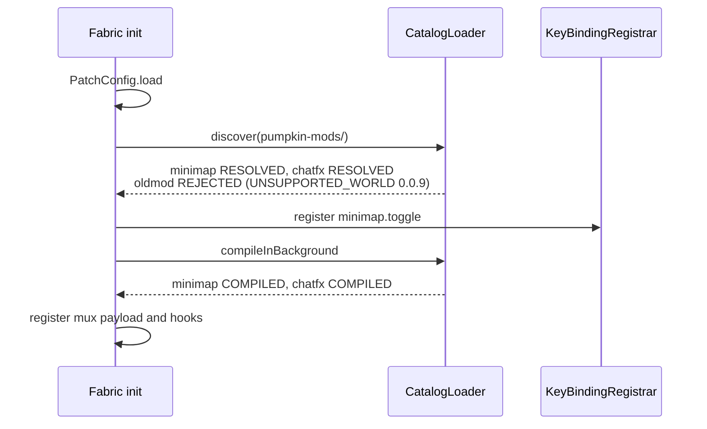
```mermaid
sequenceDiagram
  participant F as Fabric init
  participant CL as CatalogLoader
  participant K as KeyBindingRegistrar

  F->>F: PatchConfig.load
  F->>CL: discover(pumpkin-mods/)
  CL-->>F: minimap RESOLVED, chatfx RESOLVED<br/>oldmod REJECTED (UNSUPPORTED_WORLD 0.0.9)
  F->>K: register minimap.toggle
  F->>CL: compileInBackground
  CL-->>F: minimap COMPILED, chatfx COMPILED
  F->>F: register mux payload and hooks
```

### 35.2 Joining a Pumpkin server and exchanging a message

```mermaid
sequenceDiagram
  participant S as Pumpkin server
  participant H as Pumpkin Patch (core)
  participant M as minimap
  participant CF as chatfx

  S->>H: HELLO{minimap required}
  H->>S: REPLY{minimap AVAILABLE}
  S->>H: ACCEPT{JOIN, minimap → route 1}
  Note over H: join creates Session 1 (PUMPKIN)
  H->>M: instantiate, init()
  M-->>H: subscriptions {tick, world}, now ACTIVE
  H->>CF: instantiate, init()
  Note over CF: activation=always, not in HELLO<br/>ACTIVE, net returns unavailable
  Note over H: tick 1
  H->>M: handle-events([session-started, world-changed(overworld, 1), tick])
  S->>H: DATA{1, ch0 "markers", 120 B} via Netty → InboundQueue
  Note over H: tick 2
  H->>M: handle-events([net-message, tick])
  M->>H: net.send("config", 8 B) → outbox
  M-->>H: return
  H->>S: DATA{1, ch1, 8 B}
  Note over S: reply reaches the server component on route 1
```

### 35.3 A trap in one component

```mermaid
sequenceDiagram
  participant H as Pumpkin Patch
  participant M as minimap
  participant CF as chatfx

  Note over H: tick N
  H->>M: handle-events
  M-->>H: ok, effects applied
  H->>CF: handle-events
  CF--xH: trap (unreachable)
  Note over H,CF: outbox discarded, chatfx FAULTED<br/>FaultRecord + toast "chatfx stopped"<br/>route CLOSEd, remaining instances called normally
  Note over H: tick N+1
  H->>M: handle-events
  M-->>H: ok
  Note over H,CF: chatfx receives nothing until the next session creates a fresh instance
```

### 35.4 HUD render

```mermaid
sequenceDiagram
  participant T as Tick
  participant R as HUD hook (frame)
  participant M as minimap

  T->>R: mark minimap render-due
  R->>M: render(frame{w, h, tick})
  M-->>R: commands[rect, text ×3], cached
  loop following frames
    R->>R: draw cached list, no guest call
  end
  T->>R: next tick, render due again
  R->>M: render(frame)
  M-->>R: unchanged, cache kept
```

### 35.5 A dimension change invalidates a cached world snapshot

```mermaid
sequenceDiagram
  participant F as Fabric
  participant H as Pumpkin Patch (tick)
  participant G as Guest

  F->>H: enqueueWorldChanged(nether)
  H->>H: epoch 1 → 2
  H->>G: handle-events([world-changed(nether, 2), tick])
  G->>H: view.current-world()
  H-->>G: world-ref(nether, 2)
  G->>G: discard cached world-ref(overworld, 1)
```

### 35.6 A required mod is missing

```mermaid
sequenceDiagram
  participant S as Pumpkin server
  participant C as Pumpkin Patch

  S->>C: HELLO{example:radar required ^2.0}
  C->>S: REPLY{radar MISSING}
  S->>C: ACCEPT{REFUSE, "This server requires example:radar ^2.0"}
  C->>C: disconnect screen shows the server message<br/>plus "not installed locally"
```

### 35.7 Disconnect and client exit

```mermaid
sequenceDiagram
  participant F as Fabric
  participant H as Pumpkin Patch
  participant G as ACTIVE instances

  F->>H: disconnect
  H->>G: final drain with session-ending
  H->>G: shutdown(), best effort
  H->>H: release stores, Session 1 CLOSED
  F->>H: client stopping (while connected)
  H->>H: close all instances without guest calls
```

---

## 36. Implementation phases

| Phase | Content | Exit criteria |
|---|---|---|
| **0. Foundations** | Gradle modules, ArchUnit rules, the draft `pumpkin:base` and `pumpkin:client` WIT, and CI against the pinned runtime release. Verify the multi-file WIT bindgen path (R6), patch-version linking (R7), and a hard call bound safe for the client thread (R4) with focused fixtures. | The WIT parses with `wasm-tools`, module rules pass, and the runtime gaps have an implementation path. R4 must pass before untrusted guests run on the client thread. |
| **1. Core with fakes** | `manifest`, `catalog`, the `component` state machine, `session`, `exec` (`GuestCaller` and the guards), `dispatch`, `host` (`HostBridge`, outbox, `EffectApplier`), `capability`, `quota`, `network` (codec, negotiator, router), and `diag`. In `testing`: the fakes and `PatchHarness`. | Scenario tests pass for the happy lifecycle, a trap in `init` leading to `FAULTED`, a denied capability leading to `REJECTED` or `denied`, two components with ordering, an oversized send leading to `limit-exceeded`, the handshake matrix, and a trap that discards the outbox. |
| **2. Runtime adapter** | `EndiveComponentRuntime`, `ComponentInspector`, `BinderRegistry`, and `V0_1Binder`. The fixtures `hello`, `echo`, `trap-init`, `trap-events`, `spin`, `oversize-send`, `denied-net`, and `wasi-import`. `GuestContractTest` and `RuntimeContractTest`. | Every fixture passes without Minecraft, every construct in the `0.1` packages round-trips, and all runtime requirements in section 11.1 pass. A declared world is checked by import/export shape rather than inferred from the binary. |
| **3. Fabric and the vertical slice (milestone M1)** | The entrypoint, tick hook, connection hooks, mux payload for configuration and play, a minimal `FabricPlayerView`, the fault toast, and `/pumpkinpatch list`, `stats`, and `faults`. | **M1:** against a Pumpkin server with a mux endpoint, or a stub server mod, the server sends a `DATA` frame, the `echo` component replies, and the server receives the reply. With `echo` and `trap-events` loaded together, `trap-events` faults and `echo` keeps working. A disconnect and rejoin creates fresh instances. |
| **4. HUD** | The `render` drain, the command cache, `FabricHudCanvas`, `hud.measure-text`, and the `hud-text` fixture. Measure the selected Endive engine with representative components, including several active at once. | Text and rectangles appear on the HUD. An idle component causes no calls per frame. Per-call and aggregate guest time meet a measured frame-time target; defaults in section 30 are tuned. |
| **5. Input and views** | Key bindings from manifests, `action` events, `view.nearby-entities`, and world epochs end to end. | A guest sees the new epoch after a live dimension change and discards its previous world snapshot. |
| **6. Ecosystem and versioning** | A Rust SDK sample mod with client and server components, `pumpkin-patch-check`, `pumpkin:client@0.2` with `V0_2Binder` alongside `V0_1Binder`. | A `0.1` component and a `0.2` component run together, and the binder drops unsupported events and counts them. |
| **7. Hardening** | Slow-tick attribution, per-mod quota overrides if needed, and documentation for mod authors. | Diagnostics answer which mod is lagging in a test scenario. |

Milestone M1 is the proof of the architecture. Nothing in phases 4 to 7 should require a change to a module boundary. If one does, this document is revised first.

---

## 37. Architectural decision summary

| # | Decision | Rationale | Alternatives considered | Consequence | Status |
|---|---|---|---|---|---|
| AD-1 | One Fabric host runs many components. | One class-loading, networking, and version story. Components carry no Java. | A Fabric wrapper mod per Pumpkin mod. | Pumpkin Patch owns lifecycle and isolation for every mod. Mods are Wasm plus a manifest. | Accepted |
| AD-2 | WIT is the stable ABI, and `pumpkin:client` is Pumpkin-owned. | Language neutrality. The Java internals stay private. | A Java API for mods. Copying Minecraft types into WIT. | WIT release discipline is required (section 21). | Accepted |
| AD-3 | `fabric → core ← engine-endive`. | Changes in Minecraft and in the runtime stay at the edges, and core is testable alone. | Layered Fabric, services, bindings, runtime. A generic runtime facade. | Two small seams, the runtime interface and the ports. The composition root is the only place where all three meet. | Accepted |
| AD-4 | Component instances are per session. Compilation is once per launch. | No state leaks between servers. Stale state ends with the session. Re-instantiation is cheap. | One instance per game. One instance per world. | Initialization runs at each join. World changes are events with epochs. | Accepted |
| AD-5 | Components run on the client thread in v0. | Direct state access, no locks, deterministic order. | A dedicated Wasm thread or pool. | A slow component costs frame time, and the call budget bounds it. | Accepted |
| AD-6 | Events are queued and drained at two points. | No Wasm inside sensitive callbacks. Predictable timing. Testable. | Direct synchronous calls from callbacks. | Events are notifications, arrive up to one tick late, and cancellable events are deferred. | Accepted |
| AD-7 | Mutating imports use an outbox. | Effects are atomic per call. One place for validation and quotas. Re-entry is impossible. Ready for async. | Applying effects inside the import. | Effects are visible after the export returns. | Accepted |
| AD-8 | One multiplexed transport, `pumpkin:mux`, with opaque payloads. | Payload types register statically. One protocol for Pumpkin. No per-mod schema versioning. | A channel per component. Typed messages in WIT. | Pumpkin implements the mux natively, and mods own their codecs. | Accepted |
| AD-9 | Components are installed by the user. | A server that pushes executable code is a remote-execution vector. | Server-delivered Wasm. | Servers state requirements. The handshake reports mismatches. | Accepted, a security boundary |
| AD-10 | Capabilities are interface-level, and a denial returns `host-error.denied`. | Simple, matches the structure of WIT, and maintainable. | Function-level grants. Resource ACLs. Link-time stubs. | Functions in gated interfaces return `result<_, host-error>`. | Accepted |
| AD-11 | Generated bindings are confined to `engine-endive/binder/vX_Y`. | Generated types are wire models. This prevents a third model and enables multiple versions. | Generated types in core. | One conversion layer per version. | Accepted |
| AD-12 | Value snapshots and epoch references replace resources. | No stale handles or cleanup. Simple across world changes. | Resources for players, worlds, and entities. | Guests re-query each tick. No resources in v0. | Accepted |
| AD-13 | Two WIT packages, `pumpkin:base` and `pumpkin:client`, organized by interface. | Fewer version combinations. Shared types stay coherent. Capabilities key off interfaces. | Eight domain packages. A single package with no shared base. | Client and server share only `pumpkin:base`. | Accepted |
| AD-14 | Java to Wasm calls are batched. | Crossing and conversion cost dominates, and batching is a breaking change to add later. | Per-event exports. Per-entity queries. A render call per frame. | At most two export calls per instance per tick. Draw lists are cached. | Accepted |
| AD-15 | No component-to-component linking or dependencies in v0. | Avoids load-order graphs, cascading faults, and a service locator. | Manifest dependencies. Component composition. | The `dependencies` key is rejected. Mods cooperate through their servers. | Accepted |
| AD-16 | Minor releases of `pumpkin:client` may break, patch releases stay compatible, and the host supports the current and previous minor version. | Bounded maintenance, and older components keep running for one release. | Every version breaking. Indefinite support. | Each minor release adds a binder. | Accepted |
| AD-17 | The manifest is a sidecar TOML file. | It is validated before compilation and is needed for key bindings at startup. | A custom section in the component. JSON. | A small TOML dependency in core. | Accepted |
| AD-18 | `render` is called at most once per tick, and the result is cached. | A guest call per frame is the largest avoidable cost. | A render call each frame. | HUD animation runs at tick rate in v0. | Accepted |
| AD-19 | The runtime must enforce a hard call budget and a memory limit before untrusted guests run on the client thread. | A runaway component must not hang the client. | Measuring and disabling after the fact. | R4 and R5 are release gates; the call ceiling is separate from acceptable frame time. | Conditional on runtime conformance |

---

## 38. Deferred decisions

| ID | Decision | Reason for deferral | Decide when |
|---|---|---|---|
| DD-1 | Sub-tick HUD interpolation, or a per-frame render mode | The cost is unknown until measured. | A mod needs smooth HUD animation. |
| DD-2 | Custom screens and world rendering | Large design surfaces that M1 does not need. | A concrete mod needs them, together with textures. |
| DD-3 | Interceptor (cancellable) hooks | They need synchronous calls in callbacks with strict budgets. | A mod needs to intercept chat or commands. |
| DD-4 | Raw key, mouse, and text input | Logical actions cover v0. | A mod needs text entry or a mouse-driven interface. |
| DD-5 | Dependencies between mods | There is no use case yet. | Two real mods need shared client state. |
| DD-6 | The `pumpkin:plugin` world adopting `pumpkin:base` types | It needs agreement with the server maintainers (OQ-7). | The server team agrees. |
| DD-7 | Secure server-assisted distribution with signing and consent | Security-sensitive, and it needs its own threat model. | Ecosystem demand. |
| DD-8 | Zip packaging (`.pmod`) | Folders suffice for v0. | Distribution tooling is needed. |
| DD-9 | Per-mod quota overrides and a policy interface | Global defaults suffice until measured. | Real mods reach the defaults. |
| DD-10 | Mux v2 with coalesced frames and compression | v1 is simpler. | Measured packet overhead justifies it. |
| DD-11 | A dedicated Wasm execution thread | The client thread suffices, and the design keeps the option open (section 16.3). | Measured frame-time impact that the call budget cannot address. |
| DD-12 | Native Component Model async | The client ABI is synchronous first. | The runtime and the server ecosystem both support it. |
| DD-13 | A second runtime | The runtime interface exists, and there is no current need. | The runtime cannot provide a required feature. |
| DD-14 | A WASI subset for guest toolchains | It depends on the languages of the first SDKs (OQ-4). | The first non-Rust SDK. |
| DD-15 | Content-mod registration and asset packaging | v0 proves the client host with existing game content. New blocks and items need Pumpkin to extend its generated vanilla data with startup mod registration, the client bridge to register matching content before Fabric freezes its static registries, and a package for states, tags, models, textures, and other assets. Network negotiation after connect cannot serve as the client registration phase. | A concrete mod adds a block or item, with both server and client implementations. |

---

## 39. Open questions and references

The following items are unresolved. Each names how to resolve it and what it blocks.

| ID | Question | How to resolve | Blocks |
|---|---|---|---|
| OQ-1 | Which release of Endive CM does Pumpkin Patch pin, how is it consumed (Maven coordinates or a project repository), and does it pass `RuntimeContractTest`, especially R4, R6, R7, and R8? | Coordinate with the runtime maintainers and run the suite. Current bindgen design notes still list multi-file packages as unsupported. | Phase 0 and 2 |
| OQ-2 | Do the target Pumpkin and Fabric versions support configuration-phase custom payloads for the handshake? Must a channel be announced before it can be sent on? What are the payload size limits in each direction? | Read the Pumpkin network configuration code and the Fabric API source for the target version, and test in a dev client. | Phase 3 |
| OQ-3 | Which server-side interface lets a Pumpkin server component send to a client component over `pumpkin:mux`, and in which repository do the `pumpkin:base` and `pumpkin:client` WIT files live? | A decision by the Pumpkin server maintainers. A native test endpoint is enough for M1. | Phase 3 (not M1) |
| OQ-4 | Which WASI interfaces, if any, do the components produced by the first SDK languages import by default? | Build sample components in each language and inspect their imports. | Phase 6 |
| OQ-5 | Which Fabric APIs are current for HUD rendering, key binding registration, and configuration and play connection events on the target Minecraft version? What is the Java baseline? Which client gametest API is available? | The Fabric documentation and Javadoc for the chosen version. | Phase 3 |
| OQ-6 | Does the runtime load under Fabric's class loader, and what is its runtime dependency closure? | A dev-client smoke test and inspection of the dependency tree. | Phase 3 |
| OQ-7 | Does `pumpkin:plugin` adopt the `pumpkin:base` types? | Discussion with the server maintainers. | DD-6 |
| OQ-8 | What hard call ceiling and aggregate per-tick guest-time target match acceptable client frame time for the selected Endive execution engine? | Benchmark representative Pumpkin components with warmup, multiple active mods, host calls, and allocation measurements. Do not substitute results from a different runtime such as TeaVM. | Phase 4 and release |
| OQ-9 | How will Pumpkin and each client loader register new content and assets from one mod package before their registries freeze, while preserving identifiers across saves and connections? | Design and test a block/item mod on both sides. Specify startup declaration, asset loading, tag/state handling, and protocol synchronization. | DD-15 and full content mods |

### References

These sources were consulted on 2026-09-29.

- Component Model: [Worlds](https://component-model.bytecodealliance.org/design/worlds.html) and [Why the Component Model?](https://component-model.bytecodealliance.org/design/why-component-model.html).
- Endive CM: the [repository](https://github.com/roastedroot/endive-cm), its [bindgen design notes](https://github.com/roastedroot/endive-cm/blob/main/bindgen-processor/design.md), and [issue #53](https://github.com/roastedroot/endive-cm/issues/53) on version selection and linking. Endive's [roadmap](https://github.com/bytecodealliance/endive#roadmap) lists performance as ongoing work.
- Pumpkin: [Pumpkin](https://github.com/Pumpkin-MC/Pumpkin), the [TypeScript plugin API](https://github.com/Pumpkin-MC/pumpkin-api-ts), the [Kotlin plugin API](https://github.com/Pumpkin-MC/pumpkin-api-kt), the [Rust plugin API](https://docs.rs/pumpkin-plugin-api/latest/pumpkin_plugin_api/), and [PR #3713](https://github.com/Pumpkin-MC/Pumpkin/pull/3713) for the asynchronous `pumpkin:plugin@0.2.0`.
- Fabric: the [networking guide](https://docs.fabricmc.net/develop/networking), [dynamic registry guide](https://docs.fabricmc.net/develop/registries/dynamic-registry), and the API Javadoc for [ServerConfigurationNetworking](https://maven.fabricmc.net/docs/fabric-api-0.144.3+26.1/net/fabricmc/fabric/api/networking/v1/ServerConfigurationNetworking.html) and [ClientPlayNetworking](https://maven.fabricmc.net/docs/fabric-api-0.110.5+1.21.4/net/fabricmc/fabric/api/client/networking/v1/ClientPlayNetworking.html).
- WebAssembly: the [GC overview](https://webassembly.org/news/2025-09-17-wasm-3.0/) describes the Wasm GC feature; guest toolchains and runtimes still determine its suitability for a given mod.
